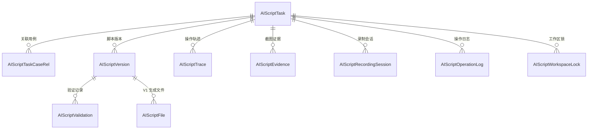
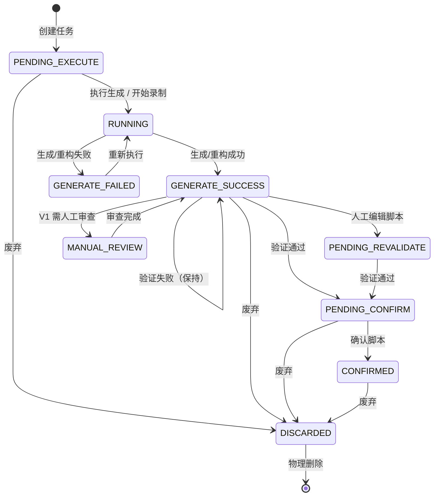
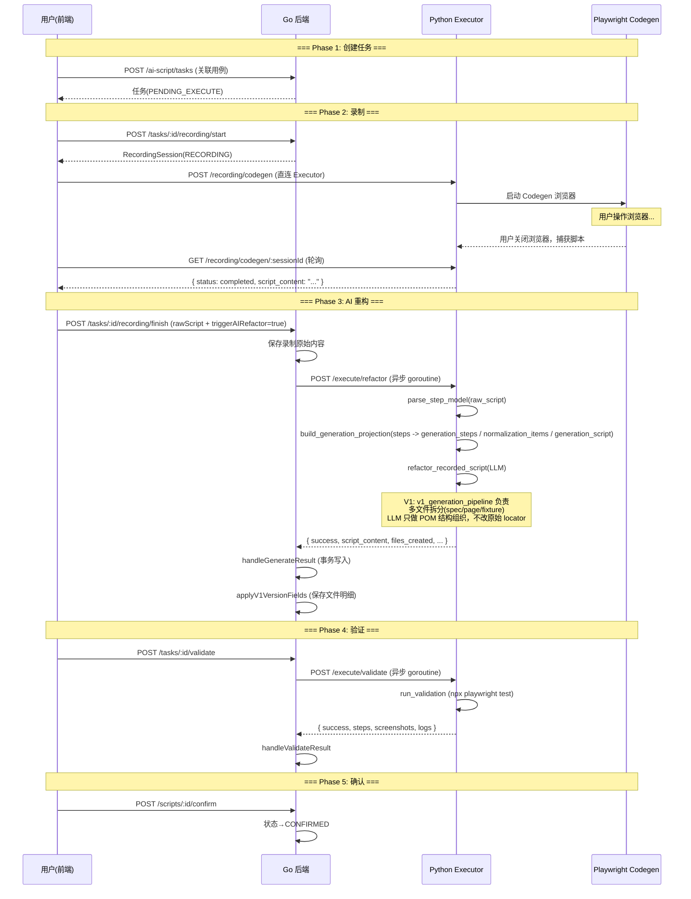
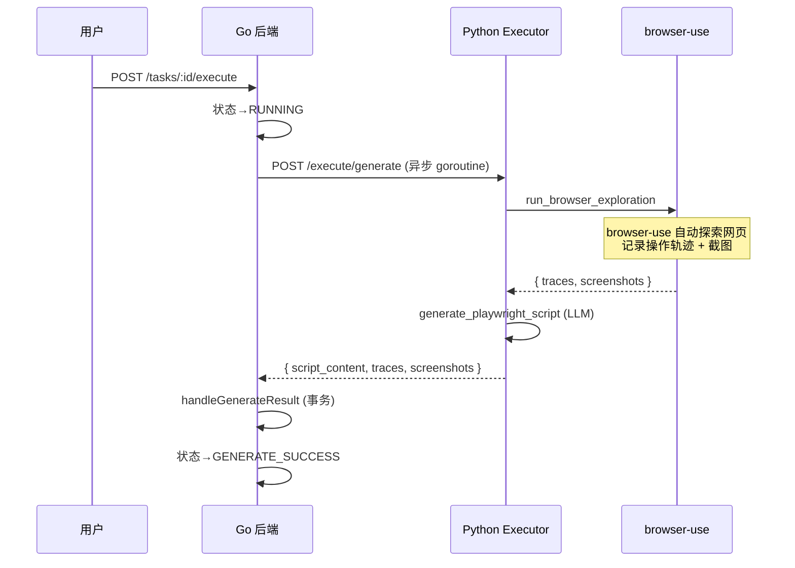
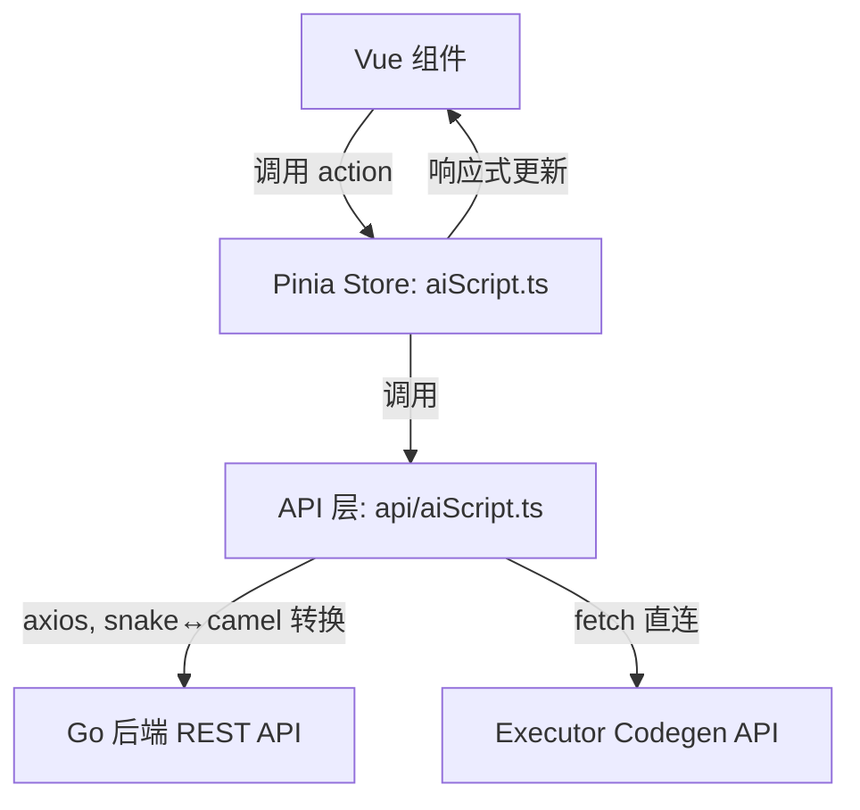

# 测试智编（TestPilot AI Script）模块 — 业务逻辑全景分析

## 一、模块定位

**测试智编**是 Aisight 测试管理平台的核心 AI 能力模块，目标是：

> **将手工测试用例自动转化为可执行的 Playwright E2E 脚本，并完成自动验证闭环。**

整个系统采用 **Go 后端 + Python Executor + Vue 前端** 三层架构：

```mermaid
graph LR
    subgraph Frontend["Vue 3 前端 (:5173)"]
        A[任务列表页] --> B[任务详情页]
        B --> C[脚本编辑器]
        B --> D[录制控制面板]
        B --> E[验证结果面板]
    end

    subgraph Backend["Go 后端 (:8080)"]
        F[handler_ai_script.go] --> G[ai_script_service.go]
        G --> H[ai_script_repo.go]
        G -->|HTTP| I[Python Executor]
    end

    subgraph Executor["Python Executor (:8100)"]
        J[/execute/generate] --> K[browser_runner.py]
        L[/execute/refactor] --> M[script_generator.py]
        N[/execute/validate] --> O[validation_runner.py]
        P[/recording/codegen] --> Q[Playwright Codegen]
        R[v1_generation_pipeline.py]
        S[project_workspace.py]
    end

    Frontend -->|REST API| Backend
    Frontend -->|直连 Executor| P
    Backend -->|内部 HTTP| Executor
```

---

## 二、数据模型（9 张核心表）

### 2.1 ER 关系



### 2.2 核心表说明

| 表名 | 作用 | 关键字段 |
|------|------|----------|
| [AIScriptTask](file:///d:/ai_project/TestPilot/internal/model/ai_script.go#L173-L205) | **任务主表** — 一个任务 = 一次脚本生成的完整生命周期 | `task_status`, `generation_mode`, `project_key` |
| [AIScriptTaskCaseRel](file:///d:/ai_project/TestPilot/internal/model/ai_script.go#L208-L214) | 任务↔测试用例 多对多关联 | `task_id`, `case_id` |
| [AIScriptVersion](file:///d:/ai_project/TestPilot/internal/model/ai_script.go#L217-L251) | **脚本版本表** — 每次编辑/生成/重构都产生新版本 | `version_no`, `is_current_flag`, `script_content` |
| [AIScriptValidation](file:///d:/ai_project/TestPilot/internal/model/ai_script.go#L254-L276) | **回放验证记录** — 每次 Playwright 运行的结果 | `validation_status`, `total_step_count`, `passed_step_count` |
| [AIScriptTrace](file:///d:/ai_project/TestPilot/internal/model/ai_script.go#L279-L293) | 结构化操作轨迹（browser-use 探索产出） | `action_type`, `locator_used` |
| [AIScriptEvidence](file:///d:/ai_project/TestPilot/internal/model/ai_script.go#L296-L309) | 截图/日志/DOM 等证据附件 | `evidence_type`, `file_url` |
| [AIScriptRecordingSession](file:///d:/ai_project/TestPilot/internal/model/ai_script.go#L324-L336) | Playwright Codegen 录制会话 | `recording_status`, `raw_script_content` |
| [AIScriptFile](file:///d:/ai_project/TestPilot/internal/model/ai_script.go#L353-L366) | **V1 多文件明细** — 记录生成产出的所有文件 | `file_type`, `relative_path`, `content` |
| [AIScriptWorkspaceLock](file:///d:/ai_project/TestPilot/internal/model/ai_script.go#L370-L382) | **项目级工作区锁** — 防并发破坏 | `lock_type`, `status`, `expires_at` |

---

## 三、状态机

### 3.1 任务状态流转（TaskStatus）



### 3.2 验证状态（ValidationStatus）

| 状态 | 含义 | 触发条件 |
|------|------|----------|
| `NOT_VALIDATED` | 未验证 | 新版本创建、编辑后 |
| `VALIDATING` | 验证中 | 触发验证时 |
| `PASSED` | 验证通过 | Playwright 所有 step 通过 |
| `FAILED` | 验证失败 | 有 step 失败 |
| `ERROR` | 验证异常 | Executor 调用出错 |

---

## 四、两种生成模式

### 4.1 录制增强模式（RECORDING_ENHANCED）— 主流程

这是当前推荐的主流程，用户先录制操作，再由 AI 增强：



### 4.2 AI 直生模式（AI_DIRECT）

无需录制，AI 自动探索目标网站并生成脚本：



---

## 五、API 路由总览

所有路由注册于 [router.go](file:///d:/ai_project/TestPilot/internal/api/router.go#L182-L211)，基础路径 `/api/v1/ai-script/`。

### 5.1 任务管理

| 方法 | 路由 | Handler | 说明 |
|------|------|---------|------|
| GET | `/tasks` | `listAIScriptTasks` | 分页列表（支持 project_id / keyword / status 筛选） |
| POST | `/tasks` | `createAIScriptTask` | 创建任务（需关联≥1用例） |
| GET | `/tasks/:taskID` | `getAIScriptTask` | 详情（含权限标识 `permissions`） |
| POST | `/tasks/:taskID/execute` | `executeAIScriptTask` | 触发 AI 直生执行 |
| POST | `/tasks/:taskID/discard` | `discardTask` | 废弃任务（需 admin/manager） |
| DELETE | `/tasks/:taskID` | `deleteTask` | 物理删除（仅已废弃） |
| POST | `/tasks/:taskID/clone` | `cloneTask` | 克隆任务配置 |
| POST | `/tasks/:taskID/cases/update` | `updateTaskCases` | 更新关联用例 |

### 5.2 录制

| 方法 | 路由 | Handler | 说明 |
|------|------|---------|------|
| POST | `/tasks/:taskID/recording/start` | `startRecording` | Go 端创建录制会话 |
| POST | `/tasks/:taskID/recording/finish` | `finishRecording` | 提交录制脚本，可触发 AI 重构 |
| POST | `/tasks/:taskID/recording/fail` | `failRecording` | 标记录制失败，收口异常或被中断的录制会话 |
| GET | `/tasks/:taskID/recordings/latest` | `getLatestRecording` | 获取最近录制 |

> [!NOTE]
> 前端**直连 Executor** 调用 Codegen 录制：`POST /recording/codegen`、`GET /recording/codegen/:sessionId`（轮询）。
> 录制脚本持久化到 Executor 磁盘 `pending/`，防止页面刷新丢失。
> 若录制窗口关闭异常、用户取消或前端轮询失败，应调用 `POST /tasks/:taskID/recording/fail` 结束异常会话，避免记录长期停留在 `RECORDING`。

### 5.3 脚本版本

| 方法 | 路由 | Handler | 说明 |
|------|------|---------|------|
| GET | `/tasks/:taskID/versions` | `getAIScriptVersions` | 版本列表 |
| GET | `/tasks/:taskID/current-script` | `getCurrentAIScript` | 当前活跃版本 |
| POST | `/tasks/:taskID/edit-script` | `editAIScript` | 人工编辑（创建新版本） |
| POST | `/scripts/:scriptID/confirm` | `confirmScript` | 确认脚本（需验证通过） |
| POST | `/scripts/:scriptID/discard` | `discardScript` | 废弃脚本版本 |
| GET | `/scripts/:scriptID/export` | `exportScript` | 导出 .spec.ts 文件 |

### 5.4 验证

| 方法 | 路由 | Handler | 说明 |
|------|------|---------|------|
| POST | `/tasks/:taskID/validate` | `triggerAIScriptValidation` | 触发回放验证 |
| GET | `/validations/latest` | `getAIScriptLatestValidation` | 获取最新验证（query: script_version_id） |
| GET | `/scripts/:scriptID/validations` | `getValidationHistory` | 验证历史 |

### 5.5 轨迹与证据

| 方法 | 路由 | Handler | 说明 |
|------|------|---------|------|
| GET | `/tasks/:taskID/traces` | `getAIScriptTraces` | AI 探索轨迹 |
| GET | `/tasks/:taskID/evidences` | `getAIScriptEvidences` | 截图等证据 |

---

## 六、Executor 端核心模块

[main.py](file:///d:/ai_project/TestPilot/executor/main.py) 提供 FastAPI 服务，核心端点：

| 端点 | 模块 | 功能 |
|------|------|------|
| `POST /execute/generate` | [browser_runner.py](file:///d:/ai_project/TestPilot/executor/browser_runner.py) + [script_generator.py](file:///d:/ai_project/TestPilot/executor/script_generator.py) | AI 直生：browser-use 探索 → LLM 生成脚本 |
| `POST /execute/refactor` | [script_generator.py](file:///d:/ai_project/TestPilot/executor/script_generator.py) + [v1_generation_pipeline.py](file:///d:/ai_project/TestPilot/executor/v1_generation_pipeline.py) | 录制增强：原始录制 → AI 重构为标准化脚本 |
| `POST /execute/validate` | [validation_runner.py](file:///d:/ai_project/TestPilot/executor/validation_runner.py) | 回放验证：`npx playwright test` 执行脚本 |
| `POST /recording/codegen` | main.py 内联 | 启动 Playwright Codegen 浏览器录制 |
| `GET /recording/codegen/:id` | main.py 内联 | 轮询录制状态 |

### 6.1 V1 多项目工程化模块

| 模块 | 文件 | 作用 |
|------|------|------|
| 项目工作区管理 | [project_workspace.py](file:///d:/ai_project/TestPilot/executor/project_workspace.py) | 按 `project_key` 创建隔离的 Playwright 项目目录 |
| Page Registry | [page_registry.py](file:///d:/ai_project/TestPilot/executor/page_registry.py) | 管理 Page Object 注册表 (`page-registry.json`) |
| Fixture 生成 | [fixture_builder.py](file:///d:/ai_project/TestPilot/executor/fixture_builder.py) | 根据 Registry 自动生成 `base.fixture.ts` |
| 定位器守卫 | [raw_locator_guard.py](file:///d:/ai_project/TestPilot/executor/raw_locator_guard.py) | 构建 `step_model_json`、生成阶段投影，并执行原始 locator / 复杂 locator / URL 语义守卫 |
| AST 合并器 | [ast_merger/](file:///d:/ai_project/TestPilot/executor/ast_merger) | TypeScript AST 级增量合并（ts-morph） |
| 认证管理 | [auth_manager.py](file:///d:/ai_project/TestPilot/executor/auth_manager.py) + [login_handler.py](file:///d:/ai_project/TestPilot/executor/login_handler.py) | 自动登录 + 认证态缓存（storageState） |

### 6.2 工作区目录结构

每个项目在 `executor/pw_projects/projects/<project_key>/` 下拥有独立工作区：

```
pw_projects/projects/project_42/
├── pages/                    # Page Object 文件
│   └── shared/               # 共享页面（登录页等）
├── tests/                    # 生成的 .spec.ts 测试文件
├── fixtures/
│   └── base.fixture.ts       # 自动生成的 Fixture（基于 Registry）
├── registry/
│   └── page-registry.json    # Page 注册表
├── auth_states/              # 登录态缓存
├── playwright.config.ts      # 项目级配置
├── .env                      # 项目级环境变量
├── package.json
└── node_modules/             # 首次验证时自动 npm install
```

### 6.3 录制增强模式的当前事实源

当前录制增强链路已经固定为下面这组事实源：

- `raw_script`：原始录制稿，负责提供 locator 真源和完整追溯能力
- `step_model_json.steps`：原始步骤序列，完整反映录制结果
- `step_model_json.generation_steps`：平台归一化后的生成步骤，是代码生成阶段唯一业务动作序列
- `step_model_json.normalization_items`：平台显式执行过的归一化清单，当前固定规则为 `collapse_duplicate_opener_click`
- `step_model_json.generation_script`：只裁剪掉平台已确认冗余步骤后的生成用录制稿

当前平台边界：

- LLM 只允许做 POM 结构化组织、spec 编排、import 组织与中文注释补齐
- LLM 不允许改写任何原始 locator
- 除 `normalization_items` 显式声明的规则外，LLM 不允许额外删改业务步骤
- 验证主链路默认只执行当前任务生成出的目标 spec，而不是整套 Playwright suite

---

## 七、权限控制

[ComputePermissions](file:///d:/ai_project/TestPilot/internal/service/ai_script_service.go#L1453-L1490) 根据**用户角色 + 任务状态**动态计算可用操作：

| 权限 | admin | manager | tester | reviewer | 状态条件 |
|------|:-----:|:-------:|:------:|:--------:|----------|
| `canExecute` | ✅ | ✅ | ✅ | ❌ | PENDING_EXECUTE / GENERATE_FAILED |
| `canValidate` | ✅ | ✅ | ✅ | ❌ | 有脚本 + 非验证中 |
| `canEdit` | ✅ | ✅ | ✅ | ❌ | 有脚本 + 未废弃 |
| `canConfirm` | ✅ | ✅ | ❌ | ✅ | 验证通过 |
| `canExport` | ✅ | ✅ | ✅ | ✅ | 有脚本 |
| `canDiscard` | ✅ | ✅ | ❌ | ❌ | 未废弃 |
| `canDelete` | ✅ | ✅ | ❌ | ❌ | 已废弃 |

---

## 八、V1 并发保护机制

通过 `AIScriptWorkspaceLock` 表实现**数据库级分布式锁**：

- **加锁时机**：`callExecutorRefactor`（生成）和 `callExecutorValidate`（验证）前
- **锁类型**：`workspace_write`（生成）/ `validate_run`（验证）
- **过期策略**：10 分钟自动过期，防死锁
- **互斥粒度**：项目级（同一 `project_id` 的任务互斥）
- **实现**：[acquireWorkspaceLock](file:///d:/ai_project/TestPilot/internal/service/ai_script_service.go#L84-L104) 原子操作获取，defer [releaseWorkspaceLock](file:///d:/ai_project/TestPilot/internal/service/ai_script_service.go#L107-L111) 释放

---

## 九、前端架构

### 9.1 页面组件

| 组件 | 文件 | 职责 |
|------|------|------|
| 任务列表 | [AiScriptTaskList.vue](file:///d:/ai_project/TestFront/src/views/ai-script/AiScriptTaskList.vue) (34KB) | 分页列表、筛选、创建任务入口 |
| 任务详情 | [AiScriptTaskDetail.vue](file:///d:/ai_project/TestFront/src/views/ai-script/AiScriptTaskDetail.vue) (51KB) | 脚本编辑器、录制面板、验证面板、版本历史 |
| 脚本库 | [AiScriptLibrary.vue](file:///d:/ai_project/TestFront/src/views/ai-script/AiScriptLibrary.vue) (12KB) | 已确认脚本概览 |

### 9.2 数据流



> [!IMPORTANT]
> 前端 API 层使用 `toCamel` / `toSnake` 工具函数自动处理 Go 后端 `snake_case` 与前端 `camelCase` 的转换。

### 9.3 Store 核心方法

[useAiScriptStore](file:///d:/ai_project/TestFront/src/stores/aiScript.ts) 提供以下响应式状态和 action：

| 类别 | 方法 | 说明 |
|------|------|------|
| **读** | `loadTaskList` | 分页加载任务 |
| | `loadTaskDetailFull` | 并行加载详情+版本+脚本+轨迹+验证 |
| | `loadLatestValidation` | 加载最新验证结果 |
| **写** | `createTask` | 创建任务 → 刷新列表 |
| | `executeTask` | 触发执行 → 刷新详情 |
| | `updateScript` | 编辑脚本 → 刷新脚本+版本+详情 |
| | `runValidation` | 触发验证 → 刷新验证+详情 |
| | `discardTask` | 废弃任务 → 刷新列表 |
| | `deleteDiscardedTask` | 物理删除 → 刷新列表 |

---

## 十、关键设计决策总结

| 决策 | 方案 | 理由 |
|------|------|------|
| Go ↔ Executor 通信 | 异步 goroutine + HTTP | 生成/验证耗时长（30s~5min），不阻塞用户请求 |
| 脚本版本管理 | 追加式版本链 + `is_current_flag` | 保留完整编辑历史，支持回溯 |
| 录制脚本恢复 | 内存 + 磁盘双持久化 | 防页面刷新/关闭丢失录制成果 |
| 录制异常收口 | `recording/fail` 显式收口 | 避免异常会话长期停留在 `RECORDING` |
| 多项目隔离 | `project_key` 级独立工作区 | 不同项目之间的 Page/Fixture 互不干扰 |
| 并发保护 | 数据库锁表 + 10min 过期 | 防止同一项目的生成/验证并发执行破坏文件 |
| V1 多文件工程化 | POM + Fixture + Registry | 从单文件脚本进化为可维护的工程化结构 |
| 生成阶段归一化 | 平台程序侧显式归一化 | 只允许平台折叠冗余 opener 重复点击，LLM 不自行改步骤 |
| 前后端字段映射 | `toCamel` / `toSnake` 自动转换 | Go（snake_case）与 Vue（camelCase）无缝对接 |
