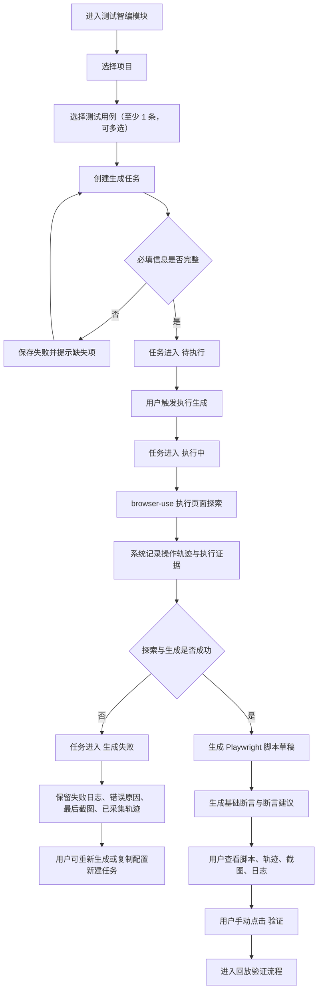
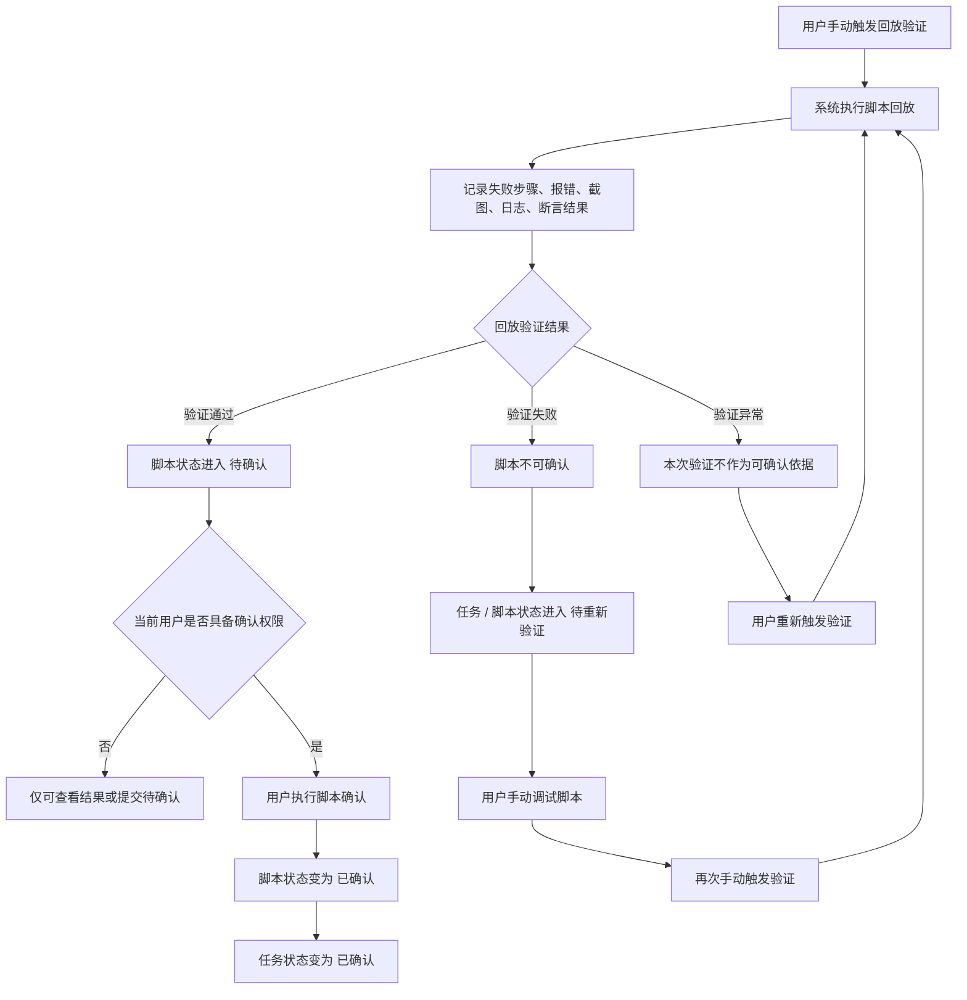
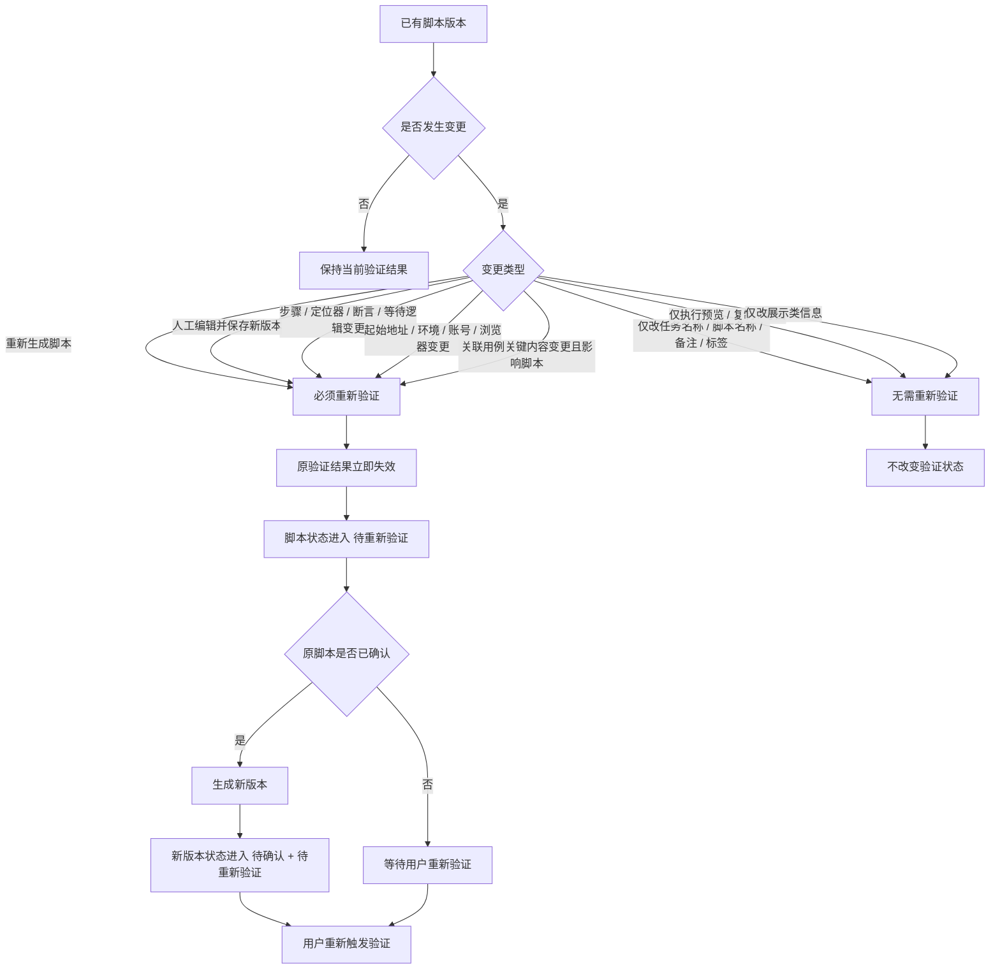

# 测试管理平台-测试智编模块业务逻辑流程图

> 版本：v0.1（创建于 2026-03-28）
> 关联文档：`测试管理平台-测试智编模块需求方案-20260327.md`、`测试管理平台-测试智编模块详细设计-20260328.md`、`测试管理平台-测试智编模块数据与接口设计-20260328.md`
> 文档定位：用于业务评审、研发评审、原型讲解和联调前对齐

## 1. 说明

本文档仅基于当前已经确认的需求输出业务逻辑流程图，不引入未确认的技术实现细节。

当前流程图覆盖以下范围：
- 任务创建到脚本确认的主业务流程
- 回放验证与脚本确认的前置关系
- 重新验证触发与状态回退逻辑

## 2. 主业务流程图

## 3. 回放验证与确认流程图

## 4. 重新验证触发逻辑图

## 5. 流程解读

### 5.1 业务主线

- 测试智编任务必须先绑定项目和至少 1 条测试用例，才能进入执行生成阶段。
- 生成成功后，系统输出 `Playwright` 脚本草稿，并同步生成轨迹、证据、断言内容或断言建议。
- 脚本生成完成并不代表可以直接确认，必须先经过手动触发的回放验证。

### 5.2 确认前置关系

- 只有回放验证结果为“验证通过”的脚本，才允许进入确认。
- 回放验证失败时，脚本不能被确认，只能先调试再重新验证。
- `admin / manager / reviewer` 才能执行最终确认，`tester` 只能提交待确认。

### 5.3 重新验证逻辑

- 影响脚本行为或回放结果的变更，都会让原验证结果失效。
- 已确认脚本一旦发生关键变更，不是原地覆盖，而是生成新版本并重新走验证与确认流程。
- 不影响脚本执行结果的展示类变更，不触发重新验证。

## 6. 建议使用方式

这份流程图建议用于：
- 产品评审时讲解业务闭环
- 研发评审时统一状态与操作顺序
- 原型设计时核对按钮显隐和可点击条件
- 联调前核对任务、脚本、验证三类状态的边界

## 7. 后续可继续补充的图

如果后面还要继续细化，建议下一步补这 3 类图：
- 页面状态流转图
- 后端时序图
- 异常处理流程图
