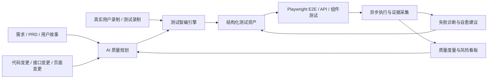

# 测试管理平台-测试智编模块可扩展方向与 AI 产品质量操作系统演进方案

> 版本：v0.1（创建于 2026-06-11）  
> 关联文档：`测试管理平台-测试智编模块需求方案-20260327.md`、`测试管理平台-测试智编模块技术架构与集成方案-20260328.md`、`测试管理平台-测试智编模块脚本编排工程化需求方案-20260609.md`、`playwright-architecture-design.md`  
> 文档定位：总结测试智编模块面向 AI 时代的可扩展方向，明确其从“E2E 脚本智能生成工具”演进为“AI 驱动的产品质量操作系统”的长期路线。

## 1. 核心结论

测试智编模块当前的主路径是正确且具备长期扩展价值的：

> 录制真实业务路径 → 抽取结构化轨迹 → AI 与确定性算法校准 → 生成 Playwright E2E 脚本 → 异步回放验证 → 失败诊断与资产沉淀。

该方案相比纯手写 E2E 脚本，能显著提升自动化测试生产效率；相比纯 AI Agent 自主测试，又具备更好的可控性、可审计性、可复现性和团队资产沉淀能力。

未来更先进的方向不是推翻该方案，而是在该闭环之上继续扩展：

- 从“生成脚本”扩展为“生成、验证、修复、沉淀、度量”的质量闭环。
- 从“单次录制任务”扩展为“需求、代码变更、接口、页面、用例、缺陷、脚本”的质量知识图谱。
- 从“人驱动测试”扩展为“AI 辅助规划 + 人工确认 + 自动执行 + 自动诊断”的协同质量工程。
- 从“E2E 自动化工具”扩展为“AI 驱动的产品质量操作系统”。

## 2. 当前测试智编的产品价值

### 2.1 对测试人员的价值

- 降低 E2E 自动化门槛：测试人员不需要熟练掌握 Playwright、TypeScript、fixture、等待策略和 locator 设计，也能通过录制和确认完成脚本生产。
- 提升脚本生成效率：由手工编码转为录制、编排、校准、验证，减少重复劳动。
- 形成可复用资产：固定场景、断言库、步骤模板、脚本版本、验证记录和失败证据可以持续复用。
- 让小白可学习：生成代码、步骤 DSL、断言设计和失败日志可作为自动化测试学习材料。

### 2.2 对团队质量体系的价值

- 自动化测试资产不再分散在个人代码仓库，而是进入平台统一管理。
- 业务流程可以被结构化编排，降低脚本复制粘贴和维护成本。
- 验证结果、截图、trace、失败原因和修复建议可以沉淀为团队知识。
- 回归测试从“谁会写脚本谁维护”转为“平台化生产与治理”。

### 2.3 对产品质量的价值

- 核心业务路径可以更快进入自动化回归。
- 每次需求变更、版本发布、缺陷修复后都能更及时地验证关键路径。
- 通过失败诊断和质量度量，逐步识别高风险页面、脆弱流程和反复失败的模块。

## 3. 目标形态：AI 驱动的产品质量操作系统

长期目标不是只做一个“AI 写脚本工具”，而是建设一个面向产品交付全链路的质量操作系统：

该系统的核心不是让 AI 随机点击页面，而是让 AI 在受控质量工程体系中承担：

- 理解需求
- 识别风险
- 规划测试路径
- 辅助生成脚本
- 分析失败原因
- 推荐修复方案
- 总结质量趋势

确定性规则、结构化资产、Playwright 回放和人工确认仍然是系统可信度的基础。

## 4. 可扩展方向一：录制增强与轨迹资产化

### 4.1 目标

将“录制到的一段原始 Playwright 代码”升级为“可理解、可治理、可复用的测试轨迹资产”。

### 4.2 能力方向

- 原始代码解析：从 codegen 脚本中提取动作、selector、输入、URL、等待、断言。
- 轨迹结构化：沉淀 `action_type`、`locator_used`、`input_value`、`page_url`、`trace_no`、截图和 DOM 证据。
- 不稳定动作过滤：识别 `.hover-row`、`:hover`、临时 active/focus class、脱敏按键、剪贴板操作等不可稳定回放动作。
- 语义化步骤命名：将 `click` 转换为“点击新建任务按钮”“打开资产探知页面”等业务描述。
- 录制质量评分：评估 locator 稳定性、等待策略、输入数据可复现性和断言覆盖情况。

### 4.3 关键原则

录制不是最终脚本，只是高价值原材料。平台必须把录制结果转成结构化资产，再进入 AI 校准和确定性编译流程。

## 5. 可扩展方向二：AI + 规则的脚本校准引擎

### 5.1 目标

让 AI 负责语义理解和建议，让规则负责安全边界和稳定性约束。

### 5.2 AI 适合负责

- 判断用户路径的业务意图。
- 给步骤命名和分组。
- 识别哪些步骤可以抽象为固定场景。
- 推荐断言点。
- 解释失败原因。
- 生成修复建议。

### 5.3 规则适合负责

- locator 安全校验。
- URL 语义保持。
- 脱敏值过滤。
- 不稳定选择器过滤。
- 事务和状态机约束。
- 生成代码的类型和语法约束。
- 回放结果的确定性判定。

### 5.4 产品判断

纯 AI 生成脚本容易不可控；纯规则生成脚本缺少语义理解。测试智编应长期坚持“AI 推理 + 确定性规则 + 回放验证”的混合架构。

## 6. 可扩展方向三：固定场景与断言库资产沉淀

### 6.1 固定场景

固定场景用于沉淀高频业务流程，例如：

- 登录系统
- 打开资产扫描任务页
- 新建资产扫描任务
- 创建测试用例
- 提交用例评审

固定场景应具备：

- 输入参数 schema
- 输出参数 schema
- 前置条件
- 后置条件
- 最新验证状态
- 引用关系
- 版本历史
- 可复用评分

### 6.2 断言库

断言库用于沉淀可复用校验点，例如：

- 页面存在某文本
- 表格出现指定记录
- 弹窗关闭
- URL 包含指定路径
- 接口返回成功
- 业务状态变为“扫描完成”

断言库应具备：

- 参数 schema
- 失败提示模板
- 证据采集策略
- 最新验证状态
- 适用页面或业务域

### 6.3 资产沉淀价值

当固定场景和断言库越来越丰富，后续脚本生成将从“从零生成”变成“资产组合”，效率和稳定性都会显著提升。

## 7. 可扩展方向四：场景编排与业务级测试流程

### 7.1 目标

将单个录制任务扩展为跨页面、跨模块、跨角色的业务级 E2E 流程。

### 7.2 能力方向

- 固定场景引用。
- 原子操作保留。
- 断言步骤插入。
- 多任务轨迹融合。
- 步骤依赖和输出映射。
- 变量与环境参数管理。
- 低置信度步骤人工确认。
- 编排版本管理。

### 7.3 典型场景

资产扫描任务页面编排可以由以下部分组成：

- 固定场景：进入资产扫描任务页面。
- 原子操作：关闭已有弹窗。
- 原子操作：点击新建任务。
- 原子操作：填写任务名称。
- 原子操作：点击确定。
- 断言：任务列表出现新建任务。

### 7.4 关键原则

业务级 E2E 不应依赖一整段脆弱录制脚本，而应由可复用固定场景、稳定原子动作和明确断言组合生成。

## 8. 可扩展方向五：AI 自主探索测试

### 8.1 定位

AI 自主探索适合发现未知风险，但不适合作为稳定回归主路径。

### 8.2 适合场景

- 新页面冒烟探索。
- 表单边界输入尝试。
- 权限菜单探索。
- 异常流程探索。
- 未覆盖路径发现。
- 竞品或历史版本行为对比。

### 8.3 不适合场景

- 发布前稳定回归主链路。
- 需要严格审计的核心交易流程。
- 高并发、大批量、低成本执行场景。

### 8.4 正确使用方式

> AI 自主探索负责发现风险，测试智编负责把高价值路径沉淀为确定性 Playwright 脚本。

## 9. 可扩展方向六：需求到测试的自动规划

### 9.1 目标

从需求文档、用户故事、验收标准、接口说明和设计稿中自动提取测试目标。

### 9.2 能力方向

- 需求条款拆解。
- 测试点生成。
- 正向路径、异常路径、边界路径识别。
- 推荐 E2E 覆盖路径。
- 推荐 API 测试和组件测试覆盖点。
- 自动匹配已有固定场景和断言资产。

### 9.3 与测试智编的结合

需求侧 AI 负责回答“应该测什么”；测试智编负责回答“如何生成可执行脚本并验证”。

## 10. 可扩展方向七：变更影响分析与风险驱动回归

### 10.1 目标

每次代码、接口、配置、页面或需求变更后，自动判断应该运行哪些测试，而不是盲目全量回归。

### 10.2 数据来源

- Git diff
- 接口变更
- 前端路由和组件变更
- 后端 handler/service/repository 变更
- 数据库 migration
- 需求变更
- 历史缺陷和失败记录

### 10.3 输出结果

- 受影响页面
- 受影响业务流程
- 推荐回归脚本
- 推荐补充用例
- 风险等级
- 发布阻断建议

### 10.4 产品价值

风险驱动回归可以降低 E2E 执行成本，让测试资源集中在最可能出问题的区域。

## 11. 可扩展方向八：失败诊断与自愈建议

### 11.1 失败分类

验证失败应自动归因到以下类型：

- 产品缺陷
- locator 失效
- 等待策略不足
- 测试数据污染
- 登录态失效
- 环境不可用
- 权限不足
- 脚本过时
- 第三方服务异常
- 录制残留动作不可复现

### 11.2 诊断输入

- Playwright 错误栈
- trace.zip
- 截图
- DOM snapshot
- 控制台日志
- 网络请求
- 当前脚本版本
- 最近产品变更
- 历史失败记录

### 11.3 自愈能力

- 推荐更稳定 locator。
- 自动补充等待条件。
- 替换脱敏测试数据。
- 移除不可回放临时动作。
- 更新固定场景 DSL。
- 生成脚本 patch。
- 自动重新验证。

### 11.4 边界

系统可以自动给出修复建议和低风险 patch，但核心业务断言、危险操作和大范围脚本重构应保留人工确认。

## 12. 可扩展方向九：质量知识图谱

### 12.1 图谱节点

质量知识图谱应逐步关联以下对象：

- 项目
- 模块
- 页面
- 接口
- 需求
- 测试用例
- AI 生成任务
- 固定场景
- 断言资产
- 场景编排
- 脚本版本
- 验证记录
- 缺陷
- 失败证据
- 修复建议

### 12.2 图谱关系

- 需求覆盖哪些用例
- 用例关联哪些脚本
- 脚本覆盖哪些页面和接口
- 固定场景被哪些编排引用
- 断言库被哪些脚本使用
- 缺陷来自哪次验证
- 某次代码变更影响哪些质量资产

### 12.3 AI 价值

有了质量知识图谱，AI 才能更准确地回答：

- 这个需求缺哪些测试？
- 这个改动该跑哪些回归？
- 哪些脚本最脆弱？
- 哪些页面质量风险最高？
- 哪些缺陷可能复发？

## 13. 可扩展方向十：质量度量与发布门禁

### 13.1 关键指标

- 核心路径自动化覆盖率
- E2E 通过率
- 脚本稳定性
- 平均失败诊断耗时
- 平均修复耗时
- 缺陷逃逸率
- 高风险模块数量
- 回归执行耗时
- flaky 测试占比
- 自动修复采纳率

### 13.2 质量门禁

发布前可设置：

- 核心业务路径必须全部通过。
- 高风险变更必须执行推荐回归集。
- 新增需求必须有关联测试点。
- 严重缺陷修复必须新增或更新回归脚本。
- flaky 脚本超过阈值时禁止作为发布阻断依据，必须先治理。

### 13.3 产品价值

测试智编最终不只是生成测试，而是参与发布决策。

## 14. 推荐演进路线

### 阶段一：E2E 智能生产闭环

目标：把录制、生成、验证、失败记录跑稳定。

重点能力：

- 录制增强
- 结构化轨迹
- Playwright 生成
- 异步验证
- 日志、截图、trace 证据
- 不稳定动作过滤
- 固定场景和断言库基础版本

### 阶段二：资产化与编排化

目标：让脚本从“单次生成”升级为“可复用资产组合”。

重点能力：

- 固定场景版本治理
- 断言库治理
- 场景编排工作台
- 多任务轨迹融合
- AI 断言建议
- 编排发布、回滚和引用影响分析

### 阶段三：失败诊断与自愈

目标：降低维护成本，提高脚本长期稳定性。

重点能力：

- 失败分类
- locator 修复建议
- 等待策略建议
- 测试数据修复建议
- 自动 patch 草案
- 修复后自动重跑

### 阶段四：需求与变更驱动测试

目标：从“人手动触发测试”升级为“系统根据需求和变更推荐测试”。

重点能力：

- 需求到测试点生成
- 代码变更影响分析
- 风险驱动回归集
- 发布前质量门禁
- 缺陷复发风险分析

### 阶段五：AI 产品质量操作系统

目标：形成贯穿需求、开发、测试、发布、运维反馈的质量智能平台。

重点能力：

- 质量知识图谱
- AI 自主探索
- 多模态证据分析
- 质量趋势预测
- 自动生成质量报告
- 面向管理者的质量风险驾驶舱

## 15. 架构原则

### 15.1 可信优先

AI 生成内容必须经过确定性校验、回放验证和必要的人工确认，不能直接进入核心回归资产。

### 15.2 资产优先

每一次录制、生成、失败和修复都应该沉淀为可复用资产，而不是一次性结果。

### 15.3 异步优先

录制、生成、验证、AI 推理和回归执行都属于长任务，应采用异步任务、状态轮询、结果回写和证据采集。

### 15.4 可解释优先

系统必须说明为什么生成这些步骤、为什么跳过某些录制动作、为什么推荐某个断言、为什么判定失败。

### 15.5 人机协同优先

AI 负责提效和建议，人负责业务确认和关键风险决策。系统应避免把不可解释的 AI 输出直接作为发布依据。

## 16. 风险与治理

### 16.1 技术风险

- AI 输出不稳定。
- 录制脚本存在临时状态和脱敏数据。
- E2E 执行慢、成本高。
- locator 易受 UI 改版影响。
- 测试数据污染导致结果不可信。
- 环境和登录态问题被误判为产品缺陷。

### 16.2 治理策略

- 关键链路采用确定性规则和回放验证。
- 引入 locator 稳定性评分。
- 将 flaky 脚本纳入治理队列。
- 对测试数据进行隔离和自动清理。
- 将环境问题和产品缺陷分开归因。
- 所有 AI 修改建议必须可追溯、可回滚。

## 17. 最终定位

测试智编模块的长期定位可以概括为：

> 让普通测试通过录制完成自动化，让资深测试通过编排沉淀资产，让 AI 通过探索、规划和诊断持续发现质量风险，最终形成 AI 驱动的产品质量操作系统。

它不是单纯的脚本生成器，而是产品质量资产的生产、执行、诊断、治理和度量平台。

