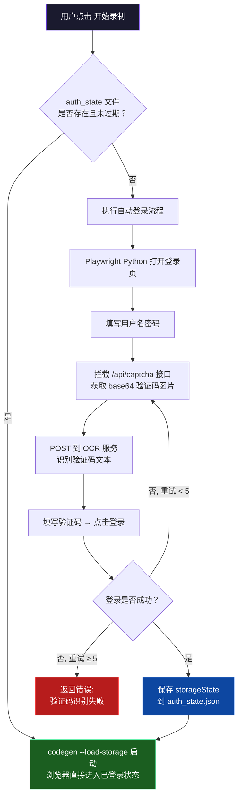
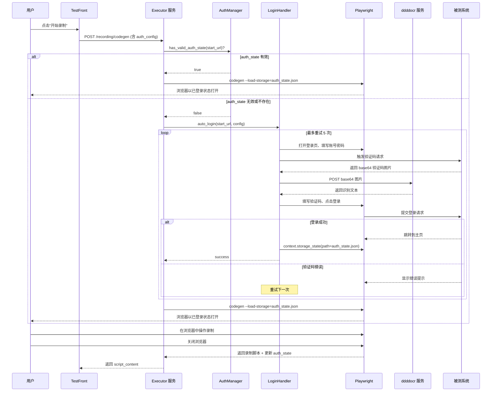

# 测试管理平台-测试智编模块录制登录态持久化与验证码识别方案

> 版本：v1.0（创建于 2026-03-30）
> 关联文档：`测试管理平台-测试智编模块技术架构与集成方案-20260328.md`
> 文档定位：解决录制模式下每次重新登录的体验问题，实现登录态自动持久化与验证码智能识别

## 1. 问题与目标

### 1.1 当前问题

在"录制增强模式"下，用户每次点击"开始录制"时：

1. Playwright Codegen 启动**全新的浏览器实例**，无任何 Cookie/localStorage
2. 用户每次都必须**重新登录**被测系统
3. 登录过程中的**图形验证码**需要人工识别
4. 整个登录过程浪费大量时间，严重影响录制效率

### 1.2 目标

| 目标 | 说明 |
|------|------|
| 首次登录 + Token 复用 | 首次录制完成登录后，后续录制自动加载已保存的登录态，跳过登录流程 |
| Token 到期自动感知 | 检测 Cookie/Token 是否过期，过期后自动触发重新登录 |
| 验证码智能识别 | 复用已有 ddddocr OCR HTTP 服务自动识别图形验证码 |
| 识别失败自动重试 | 验证码 OCR 识别不准确时自动重试，最多 5 次 |
| 用户无感 | 除首次登录外，后续录制应直接进入已登录状态，用户无感知 |

## 2. 技术方案总览

### 2.1 核心技术选型

| 技术点 | 方案 | 说明 |
|--------|------|------|
| 浏览器状态持久化 | Playwright `storageState` | 保存/加载 Cookie、localStorage、IndexedDB |
| Codegen 状态加载 | `--load-storage` / `--save-storage` | Playwright Codegen 原生支持的认证状态参数 |
| 验证码 OCR | 已部署的 ddddocr HTTP 服务 | `http://10.10.10.200:9898/ocr/b64/text`，无需新增依赖 |
| 验证码获取 | API 响应拦截 | 拦截 `/api/captcha` 接口获取 base64 图片，与 fobrain Cypress 项目一致 |
| 自动登录脚本 | Playwright Python API | 使用 `playwright.async_api` 执行登录流程 |
| 异步 HTTP 调用 | httpx | 调用 OCR 服务 |

### 2.2 方案来源

本方案借鉴自 fobrain 2.0 自动化测试项目（`fobrain_2.0_automated`）中已验证的登录与验证码识别方案，核心模式对应如下：

| fobrain Cypress 方案 | TestPilot 适配方案 |
|---|---|
| `getCaptchaAndRecognize()` — 拦截验证码 API + POST OCR | `_recognize_captcha_via_api()` — Playwright route 拦截 + POST OCR |
| `tryLogin()` — 递归重试 max 5 次 | `auto_login()` — 循环重试 max 5 次 |
| `cy.writeFile(tokenFilePath, { authToken })` — 持久化 Token | `context.storage_state(path=...)` — 保存完整浏览器状态 |
| `cy.session({ cacheAcrossSpecs: true })` — 跨用例共享会话 | `--load-storage` — 跨录制会话共享认证状态 |

### 2.3 整体流程图



### 2.4 时序图



## 3. 详细设计

### 3.1 认证状态管理器（auth_manager）

#### 职责

- 按目标域名管理 Playwright `storageState` 文件
- 检测 Cookie/Token 是否过期
- 提供状态查询和主动失效接口

#### 存储结构

```
executor/
  auth_states/              ← 新增目录（.gitignore 排除）
    192.168.1.100.json      ← 按域名/IP 命名的 auth_state 文件
    your-system.com.json
```

#### 过期检测策略

采用**双重检测**机制：

| 检测方式 | 判定规则 | 说明 |
|---------|---------|------|
| 文件年龄 | 文件修改时间 > 最大有效期（默认 24h） | 简单粗暴，兜底策略 |
| Cookie 过期 | 所有 session 相关 Cookie 的 `expires` < 当前时间 | 精确检测，按实际过期时间判断 |

Cookie 过期检测匹配规则：检查 Cookie `name` 中包含 `token`、`session`、`auth` 关键字的条目。

#### 核心接口

```python
def get_auth_state_path(start_url: str) -> str
    """根据 URL 域名获取 auth_state 文件路径"""

def has_valid_auth_state(start_url: str) -> bool
    """检查指定 URL 是否存在有效的 auth_state（双重过期检测）"""

def invalidate_auth_state(start_url: str) -> None
    """主动删除指定 URL 的 auth_state（用于强制重新登录）"""
```

### 3.2 自动登录处理器（login_handler）

#### 职责

使用 Playwright Python API 模拟用户登录操作，集成验证码自动识别，登录成功后保存浏览器状态。

#### 登录配置（LoginConfig）

```python
@dataclass
class LoginConfig:
    login_url: str                  # 登录页面 URL
    username: str                   # 用户名
    password: str                   # 密码

    # 页面选择器（默认值适配常见登录页）
    username_selector: str = "#login-username"
    password_selector: str = "#login-password"
    captcha_input_selector: str = "#login-captcha"
    captcha_img_selector: str = ""   # 验证码图片元素（备用截图方式）
    submit_selector: str = "#login-submit"

    # 验证码相关
    captcha_api: str = "/api/captcha"                           # 验证码接口路径
    ocr_service_url: str = "http://10.10.10.200:9898/ocr/b64/text"  # OCR 服务地址

    # 登录结果判断
    success_url_pattern: str = ""    # 登录成功后 URL 正则
    success_element: str = ""        # 登录成功后出现的元素选择器
    error_element: str = ""          # 验证码错误提示元素
    error_text: str = "验证码错误"    # 验证码错误提示文本

    max_retries: int = 5             # 最大重试次数
```

#### 验证码识别流程

提供两种互补的验证码获取方式：

**方式一：API 响应拦截（推荐，与 Cypress 方案一致）**

```
拦截 /api/captcha GET 请求 → 从 response.body.data.image 提取 base64
→ 去掉 data:image/...;base64, 前缀
→ POST 到 OCR 服务 → 返回识别文本
```

对应 Cypress 代码中的：
```javascript
cy.intercept('GET', '/api/captcha').as('getCaptcha');
cy.wait('@getCaptcha').then((interception) => {
    Cypress.env('captchaImage', interception.response.body.data.image);
});
cy.request({ method: 'POST', url: 'http://10.10.10.200:9898/ocr/b64/text',
             body: captchaImage.split(',')[1] });
```

**方式二：元素截图（备用）**

```
定位验证码  元素 → screenshot() 获取二进制
→ base64 编码 → POST 到 OCR 服务 → 返回识别文本
```

适用于验证码不通过 API 返回 base64 的场景。

#### 重试机制

与 fobrain Cypress 项目的 `tryLogin()` 逻辑对齐：

```
循环 attempt = 1..5:
    1. 识别验证码
    2. 填写验证码并提交
    3. 等待 3 秒（与 Cypress cy.wait(3000) 一致）
    4. 检查登录结果：
       - URL 变化（不再包含 /login）→ 成功
       - 成功元素出现 → 成功
       - 出现"验证码错误"提示 → 等待 2 秒后重试
    5. 如果 attempt >= 5 → 放弃，返回失败
```

#### 登录成功判定

支持三种互补的判定方式（任一满足即视为成功）：

| 判定方式 | 配置字段 | 示例 |
|---------|---------|------|
| URL 模式匹配 | `success_url_pattern` | `.*/dashboard.*` |
| 元素出现 | `success_element` | `.user-avatar`, `#workspace` |
| URL 变化（兜底） | 自动检测 | 当前 URL 已不再是登录页 |

### 3.3 Codegen 启动流程改造

#### 改造前

```
用户点击"开始录制"
  → POST /recording/codegen { task_id, start_url }
    → npx playwright codegen --output <file> <start_url>
      → 全新浏览器，无登录态
```

#### 改造后

```
用户点击"开始录制"
  → POST /recording/codegen { task_id, start_url, auth_config? }
    → AuthManager 检查 auth_state
      → 如无有效状态 → LoginHandler 自动登录 → 保存 auth_state
    → npx playwright codegen
        --load-storage=auth_state.json    ← 加载登录态
        --save-storage=auth_state.json    ← 录制结束后更新
        --output <file> <start_url>
      → 浏览器以已登录状态打开
```

#### Codegen 命令变化

```bash
# 改造前
npx -y playwright codegen --ignore-https-errors --target playwright-test \
    --output "codegen_abc.ts" "https://your-system.com"

# 改造后
npx -y playwright codegen --ignore-https-errors --target playwright-test \
    --load-storage="./auth_states/your-system.com.json" \
    --save-storage="./auth_states/your-system.com.json" \
    --output "codegen_abc.ts" "https://your-system.com"
```

### 3.4 前端适配

#### 录制流程改造

前端 `handleStartRecording()` 函数的变化：

1. **解析 account_ref 字段**：尝试将 `account_ref` 按 JSON 解析，如果成功则作为 `auth_config` 传递给 Executor
2. **传递 auth_config**：在 `launchCodegen()` 请求中携带登录配置
3. **状态文案适配**：轮询时增加 `logging_in` 状态的展示（"🔐 正在自动登录系统..."）

#### 录制状态扩展

| 状态 | 文案 | 说明 |
|------|------|------|
| `starting` | 正在检查登录状态... | Executor 正在检查 auth_state |
| `logging_in` | 🔐 正在自动登录系统（识别验证码中）... | **新增**，自动登录进行中 |
| `recording` | 🔴 录制中... 请在弹出的浏览器中操作 | 录制进行中 |
| `completed` | ✅ 录制完成！脚本已自动回收 | 录制结束 |
| `error` | ❌ 录制出错 / 自动登录失败 | 出错 |

## 4. 配置设计

### 4.1 Executor 环境变量新增

在 `executor/.env` 中新增以下配置：

```bash
# ── 认证状态管理 ──
AUTH_STATE_DIR=./auth_states                           # auth_state 文件存储目录
AUTH_STATE_MAX_AGE_HOURS=24                            # auth_state 最大有效期（小时）

# ── OCR 验证码识别服务 ──
OCR_SERVICE_URL=http://10.10.10.200:9898/ocr/b64/text  # ddddocr HTTP 服务地址

# ── 默认登录配置（可选，适用于固定被测系统） ──
DEFAULT_LOGIN_URL=                                     # 默认登录页 URL
DEFAULT_LOGIN_USERNAME=                                # 默认用户名
DEFAULT_LOGIN_PASSWORD=                                # 默认密码
```

### 4.2 account_ref 字段 JSON 格式约定

复用现有任务表的 `account_ref` 字段（VARCHAR(256)），约定 JSON 格式存储登录配置：

```json
{
  "login_url": "https://your-system.com/login",
  "username": "admin",
  "password": "admin@123",
  "captcha_api": "/api/captcha",
  "selectors": {
    "username": "#login-username",
    "password": "#login-password",
    "captcha_input": "#login-captcha",
    "captcha_img": ".captcha-img",
    "submit": "#login-submit"
  },
  "success": {
    "url_pattern": ".*/dashboard.*",
    "element": ".user-avatar"
  }
}
```

**向后兼容**：如果 `account_ref` 不是有效 JSON（旧数据的纯文本格式），则忽略 auth_config，使用环境变量中的默认登录配置。无需修改数据库表结构。

### 4.3 配置优先级

```
任务级 auth_config（account_ref JSON）
  ↓ 未配置则降级
环境变量默认配置（DEFAULT_LOGIN_*）
  ↓ 未配置则跳过
不执行自动登录，codegen 直接打开（行为与改造前一致）
```

## 5. 新增 API 接口

### 5.1 Executor 服务新增接口

| Method | Path | 说明 |
|--------|------|------|
| GET | `/auth/status?start_url=xxx` | 查询指定 URL 的认证状态（是否有有效 auth_state） |
| POST | `/auth/invalidate?start_url=xxx` | 手动清除指定 URL 的认证状态（强制下次重新登录） |

**`GET /auth/status` 响应示例：**

```json
{
  "has_valid_auth": true,
  "auth_state_file": "./auth_states/192.168.1.100.json"
}
```

### 5.2 现有接口改动

**`POST /recording/codegen` 请求体扩展：**

```json
{
  "task_id": 1,
  "start_url": "https://your-system.com/dashboard",
  "auth_config": {
    "login_url": "https://your-system.com/login",
    "username": "admin",
    "password": "admin@123",
    "captcha_api": "/api/captcha",
    "selectors": { ... },
    "success": { ... }
  }
}
```

`auth_config` 为可选字段，未传入时使用环境变量默认配置。

## 6. 文件变更清单

### 6.1 Executor 执行服务（Python）

| 操作 | 文件 | 说明 |
|------|------|------|
| 新增 | `executor/auth_manager.py` | 认证状态管理器：存储、加载、过期检测 |
| 新增 | `executor/login_handler.py` | 自动登录处理器：Playwright 登录 + 验证码 OCR |
| 修改 | `executor/config.py` | 新增 AUTH_STATE_DIR、OCR_SERVICE_URL 等配置项 |
| 修改 | `executor/main.py` | codegen 流程集成 auth 管理，新增 auth API |
| 修改 | `executor/requirements.txt` | 新增 httpx、playwright 依赖 |
| 新增 | `executor/auth_states/` | auth_state 文件存储目录（加入 .gitignore） |

### 6.2 前端 TestFront

| 操作 | 文件 | 说明 |
|------|------|------|
| 修改 | `src/api/aiScript.ts` | launchCodegen 增加 auth_config 参数；新增 auth 状态查询 API |
| 修改 | `src/views/ai-script/AiScriptTaskDetail.vue` | 录制入口传递 auth_config；轮询增加 logging_in 状态 |

### 6.3 无需改动

| 不涉及 | 原因 |
|--------|------|
| 数据库表结构 | 复用现有 `account_ref` 字段 |
| Go 后端 | auth 逻辑完全在 Executor 侧处理 |
| 新增 Python 依赖（ddddocr） | 直接调用已部署的 OCR HTTP 服务 |

## 7. 安全与注意事项

### 7.1 敏感信息保护

- `auth_states/` 目录必须加入 `.gitignore`，禁止提交到版本控制
- `auth_state.json` 文件包含 Cookie 和 Token，需防止未授权读取
- `account_ref` 中的密码在 API 返回时应考虑脱敏（当前阶段内部使用可暂缓）
- Executor 环境变量中的密码不应出现在日志中

### 7.2 局限性

| 局限 | 说明 | 后续扩展方向 |
|------|------|-------------|
| 仅支持图形文字验证码 | ddddocr 对数字+字母类验证码识别率较高 | 后续可接入滑块、点选验证码支持 |
| OCR 识别率非 100% | 依赖重试机制兜底（5 次） | 可对接更高精度的 OCR 模型或使用 LLM Vision |
| 单浏览器实例 | 自动登录使用 headless Chromium | 与 Codegen 使用同一浏览器类型，Cookie 兼容 |

### 7.3 与现有架构的兼容性

- **不影响 AI 直生模式**：自动登录仅在录制增强模式的 codegen 流程中触发
- **不影响回放验证**：验证阶段有独立的脚本执行环境，不依赖 auth_state
- **向后兼容**：未配置 auth_config 时行为与改造前完全一致

## 8. 实施阶段建议

### 阶段一：核心功能（P0）

- 实现 `auth_manager.py` + `login_handler.py`
- 改造 `main.py` codegen 流程
- 前端传递 auth_config

### 阶段二：体验优化（P1）

- 前端录制状态卡片展示 auth 状态
- 增加"清除登录态"按钮
- 增加"手动触发登录"按钮

### 阶段三：扩展（P2）

- 支持更多验证码类型（滑块、点选）
- 支持多系统同时管理登录态
- Token 过期主动通知
