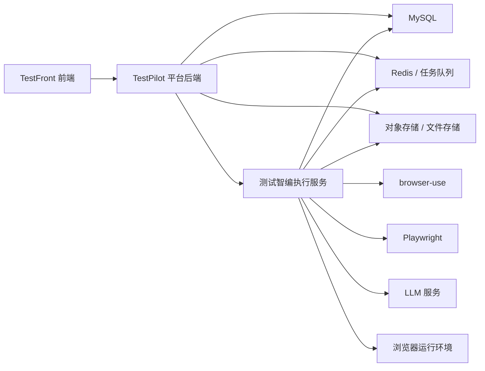
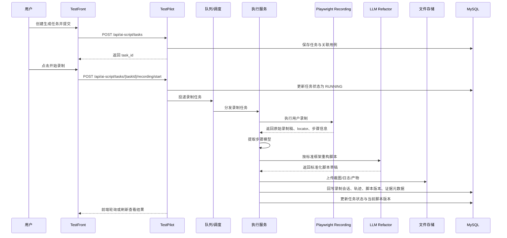
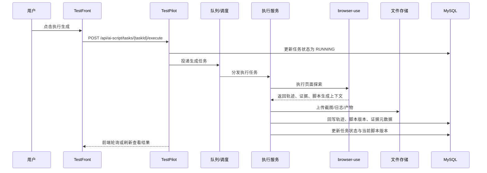
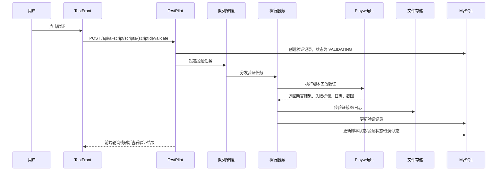

# 测试管理平台-测试智编模块技术架构与集成方案

> 版本：v0.1（创建于 2026-03-28）
> 关联文档：`测试管理平台-测试智编模块需求方案-20260327.md`、`测试管理平台-测试智编模块详细设计-20260328.md`、`测试管理平台-测试智编模块数据与接口设计-20260328.md`、`测试管理平台-测试智编模块自动化测试系统架构方案-20260329.md`
> 文档定位：用于技术评审、研发分工、系统集成设计与后续部署实施
> 2026-04-01 实现对齐说明：当前代码已进入“多项目 Playwright 工程化 V1”，若本文旧表述与当前实现冲突，以本说明及 `playwright-architecture-design.md` 为准。

## 1. 目标与结论

### 1.1 目标

为“测试智编”模块确定首期可落地的技术架构，解决以下问题：
- 平台前后端如何与开源能力集成
- `browser-use` 在整体架构中的职责边界是什么
- `Playwright` 在脚本生成与回放验证中的职责边界是什么
- 长任务执行、结果回写、日志证据、文件存储如何落地
- 首期实现怎样兼顾可用性、扩展性与开发成本

### 1.2 架构结论

首期建议采用“三层架构 + 双模式生成 + 异步执行”方案：
- 平台层：负责业务管理、权限控制、状态流转、数据存储、页面展示
- 执行服务层：负责 `Playwright` 录制、`browser-use` 场景探索、步骤模型提取、AI 标准化重构、回放验证
- 开源能力层：由 `browser-use`、`Playwright`、LLM、浏览器运行时共同组成

补充说明：
- 本文聚焦“测试智编”的脚本生成与回放验证架构
- 正式自动化回归执行体系、计划调度、套件组织、CI 集成等内容，补充见 `测试管理平台-测试智编模块自动化测试系统架构方案-20260329.md`

### 1.3 关键判断

- 前端不能直接调用开源项目，必须统一走平台后端接口
- 平台后端不建议直接内嵌 `browser-use` 逻辑，建议通过独立执行服务隔离
- 首期默认主路径应优先保证 `录制增强模式` 可用，`AI直生模式` 作为补充入口
- 首期脚本生成与回放验证都建议走异步任务模式
- `MySQL` 用于结构化业务数据，截图、日志、脚本导出文件等走对象存储或文件存储
- 若平台主后端不是 Python，执行服务建议独立采用 Python 实现，以降低 `browser-use` 与 `Playwright` 集成成本

### 1.4 当前代码实现补充（2026-04-01）

当前代码已落地的关键实现如下：

- 执行服务以多项目工作区为核心：`executor/pw_projects/projects/<project_key>/`
- 生成结果不是单文件脚本，而是 `spec_file + page_creates/page_updates + registry_updates`
- `page-registry.json` 已成为当前项目的生成决策单一事实源，shared 默认项由程序标准化补齐
- `base.fixture.ts` 由程序根据 registry 全量重建，`auth.fixture.ts` 保持固定包装层
- 生成后会经过三类关键守卫：
  - 原始 locator 保留守卫
  - 复杂原始 locator 显式覆盖守卫
  - URL 语义保留守卫
- 验证阶段会先补齐 legacy 项目的缺失支持文件，再在项目工作区内执行指定 spec
- Windows 环境下 AST 合并链路已要求固定 `UTF-8`，避免中文 locator 和中文注释在增量更新时乱码
- 共享导航层当前实现要求优先在侧边菜单容器中寻找可见菜单节点，避免误点到页面内容区同名文本

## 2. 总体架构

### 2.1 分层架构图

### 2.2 逻辑分层说明

#### 平台前端 TestFront

负责：
- 任务创建、列表、详情展示
- 生成模式选择与录制入口承接
- 轨迹、证据、脚本、验证结果可视化
- 手动触发验证、有限编辑、确认操作
- 按钮显隐、权限态展示、状态刷新

不负责：
- 直接控制浏览器
- 直接调用 `browser-use`
- 直接生成脚本

#### 平台后端 TestPilot

负责：
- 统一业务 API
- 项目、用例、权限校验
- 任务、脚本、验证记录持久化
- 调度执行服务
- 状态机与审计日志管理
- 文件元数据管理

不建议负责：
- 将 `browser-use` 直接嵌入主业务进程
- 持有长时浏览器会话执行逻辑

#### 测试智编执行服务

负责：
- 接收“生成任务”或“回放验证任务”指令
- 组装执行上下文
- 调用 `Playwright` 执行录制
- 调用 `browser-use` 执行 AI直生模式探索
- 生成结构化轨迹、原始录制稿、步骤模型、脚本草稿
- 调用 `Playwright` 执行回放验证
- 回写任务状态、验证状态、日志与结果摘要

#### 开源能力层

- `browser-use`：AI直生模式下的页面探索、操作轨迹采集、场景执行辅助
- `Playwright`：录制原稿采集、首期唯一目标脚本承载与回放验证执行
- `LLM`：理解任务描述、辅助生成脚本与断言内容、按标准框架重构录制结果
- 浏览器运行环境：Chromium / Chrome 等实际浏览器实例

## 3. 组件职责拆分

### 3.1 平台后端职责

建议新增以下模块：
- `ai_script_task_controller/service`
- `ai_script_version_controller/service`
- `ai_script_validation_controller/service`
- `ai_script_trace_controller/service`
- `ai_script_dispatch_service`
- `ai_script_callback_service`

职责拆分建议：
- `controller`：对外提供 REST API
- `service`：处理业务规则、状态流转、权限与事务
- `dispatch_service`：将生成/验证任务投递给执行服务
- `callback_service`：接收执行服务回调并更新业务状态

### 3.2 执行服务职责

建议拆为以下内部模块：
- `job_consumer`：消费任务队列或接收平台调用
- `context_builder`：组装执行上下文
- `recording_runner`：执行 `Playwright` 录制并保存原始录制稿
- `browser_use_runner`：执行探索与轨迹采集
- `step_model_builder`：从录制稿或轨迹提取结构化步骤模型
- `script_builder`：生成 `Playwright TypeScript` 脚本草稿
- `page_registry`：加载并维护当前项目的页面注册表
- `raw_locator_guard`：执行原始 locator、复杂 locator 和 URL 语义校验
- `fixture_builder`：基于 registry 重建 `base.fixture.ts`
- `ast_merger_bridge`：通过 Node/ts-morph 执行 Page Object 增量合并
- `validation_runner`：执行回放验证
- `artifact_uploader`：上传截图、日志、导出文件
- `result_reporter`：回写执行结果

### 3.3 推荐技术选型

建议：
- 平台后端：沿用 TestPilot 既有技术栈
- 执行服务：Python 主调度服务 + Node.js 运行时（用于执行 `Playwright TypeScript` 脚本和 ts-morph AST 合并器）
- 浏览器自动化：`Playwright`
- 页面探索：`browser-use`
- 存储：`MySQL + Redis + 对象存储`
- 异步：平台现有队列能力优先；无现成能力时，可使用 Redis 队列或消息队列

## 4. 集成边界

### 4.1 为什么不能直接“调用开源仓库”

原因：
- 开源项目提供的是能力，不是你们平台的业务接口
- 平台需要有自己的任务状态、权限体系、审计日志、版本管理
- 开源执行过程属于长任务，需要独立调度、异常隔离和资源控制
- 平台需要把运行结果转换成自己的轨迹模型、脚本模型和验证模型

### 4.2 browser-use 的职责边界

首期建议 `browser-use` 负责：
- 在 `AI直生模式` 下根据场景描述驱动页面探索
- 执行业务步骤
- 输出结构化动作轨迹
- 输出关键定位器候选、执行结果、关键证据

首期不建议让 `browser-use` 直接负责：
- 最终业务状态管理
- 平台权限判断
- 最终正式脚本入库规则
- 最终回归资产生命周期管理

### 4.3 Playwright 的职责边界

首期建议 `Playwright` 负责：
- 录制增强模式下采集原始录制稿、元素定位与执行逻辑
- 承载最终输出的 `TypeScript` 脚本草稿
- 承担脚本回放验证执行
- 生成验证期日志、报错、截图与断言结果

首期不建议让 `Playwright` 独立承担：
- 业务场景理解
- 自主探索页面并自动产出完整业务任务上下文

## 5. 主调用链路

### 5.1 默认主链路：录制增强模式时序图

### 5.2 辅助链路：AI直生模式时序图

### 5.3 回放验证主时序图

## 6. 异步任务与状态回写设计

### 6.1 为什么必须异步

生成任务和回放验证都具备以下特征：
- 耗时不可控
- 依赖外部浏览器和模型能力
- 可能产生大日志和截图文件
- 失败场景复杂且可能需重试

因此不建议走同步 HTTP 长连接处理。

### 6.2 建议任务模型

建议执行层至少区分两类任务：
- `GENERATE_SCRIPT`
- `VALIDATE_SCRIPT`

建议任务字段：
- `job_id`
- `job_type`
- `task_id`
- `script_version_id`
- `status`
- `retry_count`
- `payload_json`
- `created_at`
- `started_at`
- `finished_at`

### 6.3 回写原则

执行服务回写时建议遵循：
- 先写结果记录，再写聚合状态
- 原始日志、截图、证据先上传，后写元数据
- 任何失败都必须有可追溯记录
- 回调幂等，避免重复写入导致状态错乱

## 7. 存储设计

### 7.1 MySQL

适合存储：
- 任务主数据
- 用例关联关系
- 脚本版本元数据
- 验证记录元数据
- 结构化轨迹
- 审计日志

### 7.2 对象存储 / 文件存储

适合存储：
- 截图
- 回放日志原文
- 生成脚本导出文件
- HTML / DOM 快照
- 后续可能扩展的视频记录

原则：
- 数据库存元数据和地址
- 大文件不直接入库 MySQL

### 7.3 Redis / 队列

建议用途：
- 任务投递
- 任务状态中间缓存
- 分布式锁
- 并发控制
- 限流与重试控制

## 8. 运行环境设计

### 8.1 执行服务部署建议

首期建议：
- 执行服务与平台主后端分离部署
- 每个执行 Worker 独立维护自己的浏览器运行环境
- 通过环境变量注入 LLM 配置、浏览器配置、存储配置
- 具备 `Node.js` 运行时，用于执行和导出 `Playwright TypeScript` 脚本

### 8.2 浏览器运行环境

建议：
- 默认使用 Chromium
- 支持无头运行
- 支持必要时切换为有头调试模式
- 浏览器实例与任务生命周期绑定，避免跨任务污染
- `Playwright TypeScript` 执行链路应与浏览器运行环境、Node.js 版本一起纳入统一镜像或运行时基线

### 8.3 LLM 配置

建议：
- 平台只存模型配置引用，不在前端直接暴露具体密钥
- 执行服务读取安全配置后调用模型服务
- 模型切换能力保留，但首期不要暴露给普通用户选择

## 9. 稳定性与非功能建议

### 9.1 超时与重试

建议：
- 生成任务、验证任务都配置超时
- 仅对可恢复异常进行有限重试
- 用户主动重复点击验证时，若当前已在 `VALIDATING`，应直接拒绝

### 9.2 并发控制

建议：
- 同一脚本版本同一时刻只能有 1 个验证任务
- 同一任务同一时刻只能有 1 个生成任务
- 可通过分布式锁或唯一任务约束控制

### 9.3 日志与监控

建议至少监控：
- 任务执行量
- 生成成功率
- 验证成功率
- 平均生成耗时
- 平均验证耗时
- Worker 异常率
- 浏览器启动失败率
- 存储上传失败率

### 9.4 审计要求

需要审计的操作：
- 创建任务
- 执行生成
- 手动验证
- 编辑脚本
- 确认脚本
- 废弃任务/版本
- 导出脚本

## 10. 安全与边界

### 10.1 密钥与敏感信息

建议：
- 模型密钥、存储密钥、浏览器运行配置放在服务端安全配置中
- 账号信息在展示、日志、轨迹中脱敏
- 执行服务不得把敏感配置直接返回给前端

### 10.2 认证边界

当前已确认：
- 复杂认证场景如验证码、MFA、专项认证能力，本期暂不处理
- 相关边界不作为首期开发阻塞项

### 10.3 失败隔离

建议：
- 单个执行任务失败不得影响平台主站可用性
- 执行服务异常不得阻塞其他业务接口
- 执行服务可单独扩容、单独重启

## 11. 首期与后续扩展边界

### 11.1 首期必须具备

- 平台前后端完整业务闭环
- 独立执行服务
- browser-use 集成
- `Playwright TypeScript` 脚本草稿生成
- 手动回放验证
- MySQL + 文件存储 + 队列基本能力

### 11.2 后续可扩展

- Cypress 输出
- 更多模型路由策略
- 自动重试与自动修复
- 可视化脚本编辑器
- 更复杂的认证场景支持
- 与 CI / 执行中心深度集成

## 12. 推荐研发分工

建议按以下角色分工：
- 前端：任务页、详情页、脚本区、验证结果区、版本区
- 平台后端：业务 API、状态流转、权限、存储元数据、调度接口
- 执行服务：browser-use 集成、Playwright 回放、产物上传、结果回写
- 测试 / QA：状态流转校验、异常场景回归、验证链路验收

## 13. 本文档之后建议补充的实现文档

在本方案基础上，接下来最适合继续补的 P0 文档是：
1. `MySQL 表结构 SQL 草案`
2. `OpenAPI / Swagger 风格接口文档`
3. `页面原型 / 交互定稿`
4. `验收标准与联调测试清单`
