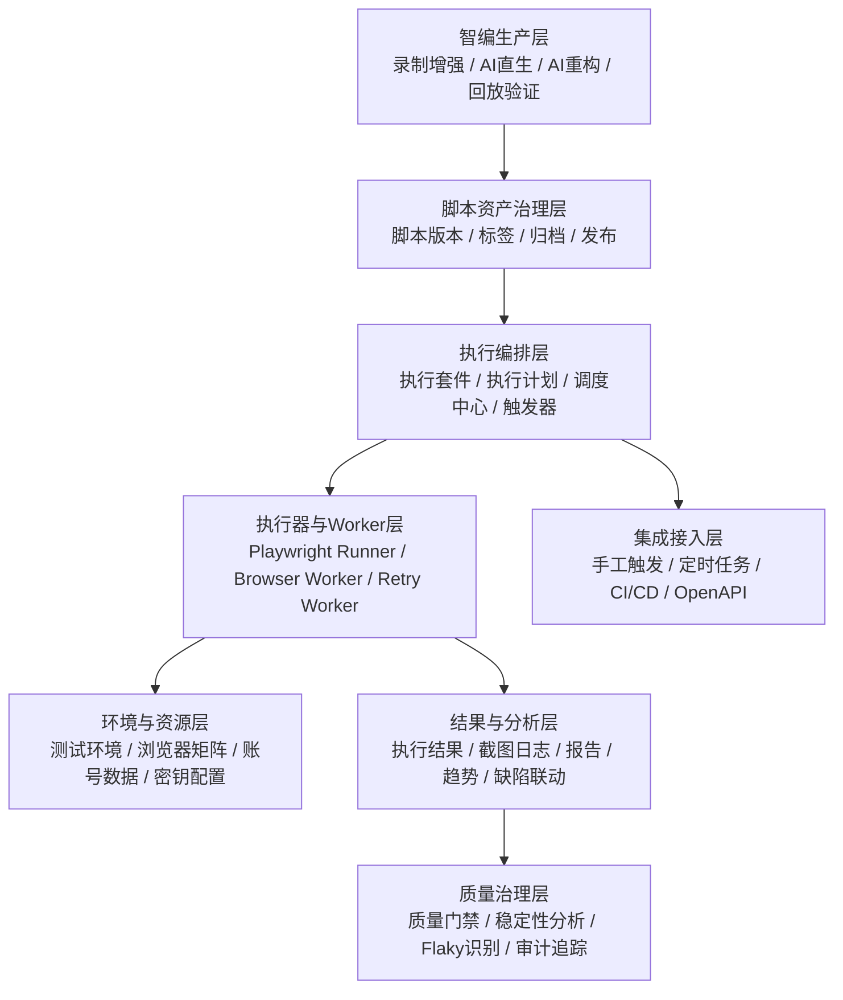

# 测试管理平台-测试智编模块自动化测试系统架构方案

> 版本：v0.1（创建于 2026-03-29）
> 关联文档：`测试管理平台-测试智编模块技术架构与集成方案-20260328.md`、`测试管理平台-测试智编模块团队标准脚本模板规范-20260329.md`、`测试管理平台-测试智编模块详细设计-20260328.md`、`测试管理平台-测试智编模块数据与接口设计-20260328.md`
> 文档定位：用于补充“测试智编”在脚本生成之外的自动化测试执行体系架构，明确从“脚本生产与回放验证”到“正式自动化回归执行”的系统分层、职责边界与演进路径

## 1. 背景与结论

### 1.1 为什么需要单独的自动化测试系统架构

当前已有文档已经覆盖以下能力：
- 测试智编任务创建与管理
- `录制增强模式` 与 `AI直生模式` 的脚本生成路径
- `Playwright TypeScript` 标准脚本模板
- 单脚本回放验证与结果回写

但这些内容更多解决的是“脚本怎么产出、怎么校验”的问题，还没有完整覆盖“脚本如何作为正式自动化资产被组织、调度、执行、分析、集成”的问题。

因此建议在“测试智编模块技术架构与集成方案”之外，补充一份面向自动化测试执行体系的独立架构文档，用于回答以下问题：
- 生成完成并确认后的脚本，如何进入正式回归体系
- 自动化脚本如何按套件、计划、环境进行批量执行
- 如何支持手工触发、定时触发、CI 触发
- 如何沉淀执行结果、失败证据、趋势报表与质量门禁
- 如何把“回放验证”与“正式自动化执行”分层治理

### 1.2 架构结论

建议将测试智编相关能力拆分为两个相互衔接但职责不同的子体系：

1. **智编生产与回放验证体系**
   - 负责录制、AI 重构、脚本草稿生成、单脚本可执行性校验
   - 目标是让脚本“产得出、看得懂、能回放”

2. **自动化测试执行体系**
   - 负责脚本资产治理、套件组织、计划调度、环境执行、结果分析、CI 集成
   - 目标是让脚本“可复用、可批量、可持续、可治理”

两者关系应明确为：
- `录制负责保真`
- `AI负责成型`
- `自动化执行系统负责规模化运行与持续治理`

## 2. 系统边界定义

### 2.1 智编回放验证 vs 自动化正式执行

| 维度 | 智编回放验证 | 自动化正式执行 |
| --- | --- | --- |
| 目标 | 检查脚本是否可运行、逻辑是否基本正确 | 按计划执行回归、输出正式结果 |
| 执行粒度 | 单脚本、单场景 | 套件、计划、批次、环境矩阵 |
| 触发方式 | 生成后手动触发为主 | 手动、定时、CI/流水线触发 |
| 数据沉淀 | 脚本草稿、验证结果、录制证据 | 执行批次、趋势分析、质量门禁、稳定性数据 |
| 成功标准 | “脚本可用” | “回归可运营” |

### 2.2 自动化测试系统不应承担的职责

自动化测试执行体系首期不建议直接承担：
- 从自然语言直接生成正式脚本
- 在执行链路中临时修改业务逻辑
- 在批量执行时动态重写脚本主逻辑
- 替代人工确认高风险断言或高风险 locator

也就是说，正式执行体系消费的是“已确认的标准脚本资产”，而不是“未经确认的生成草稿”。

## 3. 总体架构

### 3.1 分层架构图

### 3.2 分层职责说明

#### 3.2.1 智编生产层

负责：
- 录制增强模式产出基础脚本
- AI 按团队模板重构为标准 `Playwright TypeScript`
- 单脚本回放验证
- 输出脚本版本、步骤模型、风险提示、验证结论

产出结果：
- `已生成脚本`
- `待确认脚本`
- `已验证脚本`

#### 3.2.2 脚本资产治理层

负责：
- 维护脚本主版本、历史版本、发布版本
- 建立脚本与项目、模块、用例、标签的关联
- 区分“草稿版”“已确认版”“可执行版”“已归档版”
- 提供脚本发布、回退、禁用、复制能力

这是从“脚本文件”走向“测试资产”的关键层。

#### 3.2.3 执行编排层

负责：
- 定义执行套件（Suite）
- 定义执行计划（Plan）
- 定义执行批次（Run）
- 管理触发来源、并发策略、重试策略、优先级
- 决定本次执行使用哪个环境、哪个浏览器矩阵、哪批脚本资产

#### 3.2.4 执行器与 Worker 层

负责：
- 拉取已发布脚本
- 按执行计划启动 Playwright Runner
- 执行浏览器自动化任务
- 上传日志、截图、trace、video 等证据
- 支持失败重试、超时中断、资源回收

首期建议仍以 `Playwright` 作为统一执行引擎。

#### 3.2.5 环境与资源层

负责：
- 管理测试环境地址、环境变量、账号数据、密钥配置
- 管理浏览器类型、版本矩阵、并发资源池
- 提供环境隔离、账号隔离、执行资源隔离

#### 3.2.6 结果与分析层

负责：
- 汇总执行结果
- 生成报告与失败摘要
- 关联截图、日志、trace、视频
- 支持按项目、套件、计划、时间维度查询
- 输出趋势图、通过率、失败分布、平均耗时等指标

#### 3.2.7 集成接入层

负责：
- 提供手工触发入口
- 提供定时调度入口
- 提供 CI/CD 集成触发入口
- 提供开放接口供其他模块或平台调用

## 4. 核心领域对象

为避免后续系统只停留在“脚本文件管理”，建议自动化体系从一开始就引入以下核心对象：

### 4.1 脚本资产对象

- `script_asset`：可被正式执行体系消费的脚本资产
- `script_version`：脚本版本
- `script_release`：已发布到执行体系的版本快照

### 4.2 执行组织对象

- `execution_suite`：执行套件，按业务或回归范围组织脚本
- `execution_plan`：执行计划，描述何时、在哪、如何执行
- `execution_run`：一次具体执行批次
- `execution_run_item`：批次中的单脚本执行项

### 4.3 运行上下文对象

- `environment_profile`：测试环境配置
- `browser_matrix`：浏览器与版本矩阵
- `data_profile`：测试数据集配置
- `account_vault_ref`：账号与密钥引用

### 4.4 结果分析对象

- `run_result_summary`：批次汇总结果
- `run_artifact`：截图、日志、trace、video 等产物
- `flaky_signal`：疑似不稳定信号
- `quality_gate_result`：质量门禁判断结果

## 5. 触发与执行模式

### 5.1 手工触发

适用于：
- 新脚本首次纳入回归前人工确认
- 某个模块冒烟验证
- 缺陷修复后的针对性复测

特点：
- 灵活
- 粒度细
- 适合首期先打通

### 5.2 定时触发

适用于：
- 每日回归
- 每周稳定性巡检
- 固定时段健康检查

特点：
- 需要调度器
- 需要计划与环境绑定
- 需要失败通知与重试策略

### 5.3 CI/CD 触发

适用于：
- 提测后自动回归
- 合并前门禁检查
- 发布前质量拦截

特点：
- 与流水线状态强绑定
- 需要快速返回结果摘要
- 需要可配置门禁阈值

## 6. 与测试智编模块的融合方式

### 6.1 建议主路径

建议测试智编与自动化执行体系采用以下主路径：

1. 用户通过 `录制增强模式` 产出基础脚本
2. AI 按团队标准模板重构脚本
3. 用户完成检查并通过单脚本回放验证
4. 脚本进入“已确认/可发布”状态
5. 发布到自动化执行体系
6. 被纳入 Suite / Plan / Run 体系执行

这条路径符合当前团队诉求：**默认不完全依赖 AI，先保证录制保真，再让 AI 做标准化。**

### 6.2 AI直生模式在自动化体系中的定位

`AI直生模式` 不应直接成为正式回归默认入口，更适合作为：
- 草稿快速生成入口
- 无法方便录制时的补充方案
- 复杂场景探索的辅助路径

只有在脚本经过人工确认与回放验证之后，才建议进入正式自动化执行体系。

### 6.3 回放验证与正式执行的衔接规则

建议建立清晰状态门槛：

- `DRAFT`：生成完成，但未确认，不可进入正式执行
- `VERIFIED`：已完成单脚本回放验证，可申请发布
- `RELEASED`：已发布，可进入正式套件执行
- `DISABLED`：已停用，不再参与自动执行

## 7. 关键技术设计建议

### 7.1 执行引擎统一

建议正式自动化执行与智编回放验证共用 `Playwright` 作为统一执行引擎，价值在于：
- 脚本无需二次转换
- 录制稿、重构稿、执行稿保持技术一致
- 研发维护成本更低
- 便于统一日志、trace、video、report 输出

### 7.2 脚本资产与执行配置解耦

建议不要把以下信息硬编码进脚本：
- 固定环境地址
- 真实账号密码
- 固定浏览器类型
- 固定测试数据

这些内容应外置到执行配置中，由执行计划在运行时注入。

### 7.3 结果治理前置

自动化系统不应只“能跑”，还应从首期开始考虑：
- 执行证据完整性
- 失败可追溯性
- 报表一致性
- 脚本稳定性度量
- 异常重试与人工兜底

## 8. 分阶段建设建议

### 8.1 第一阶段：先打通“可执行”

目标：
- 已确认脚本可手工触发执行
- 可查看单次执行结果与证据
- 可按项目/模块查看脚本资产

建议范围：
- 脚本发布
- 手工执行
- 基础执行结果页
- 截图/日志/trace 存储

### 8.2 第二阶段：建立“可调度”

目标：
- 支持 Suite / Plan / Run 模型
- 支持定时执行
- 支持环境配置与浏览器矩阵

建议范围：
- 调度中心
- 套件管理
- 计划管理
- 环境管理
- 批量执行结果汇总

### 8.3 第三阶段：升级“可治理”

目标：
- 接入 CI/CD 质量门禁
- 支持 flaky 分析
- 支持趋势报表与稳定性评估

建议范围：
- CI 集成
- 质量门禁策略
- 趋势分析与统计
- 稳定性画像

## 9. 推荐落地原则

建议团队在方案设计与研发落地时统一遵循以下原则：
- **生成与执行分层**：智编负责产出，执行体系负责运营
- **脚本先确认再发布**：未经确认的脚本不进入正式回归
- **录制增强优先**：默认以录制增强模式作为主输入路径
- **AI 重构不改业务语义**：AI 负责结构化，不负责擅改测试意图
- **执行配置外置**：环境、账号、浏览器、数据与脚本解耦
- **结果可追溯**：每次执行都要有日志、截图和上下文证据

## 10. 与现有文档的关系

本文档是对“测试智编模块技术架构与集成方案”的补充，不替代原文档。

两份文档建议这样理解：
- `测试智编模块技术架构与集成方案`：聚焦“脚本怎么生成、怎么回放验证”
- `测试智编模块自动化测试系统架构方案`：聚焦“脚本如何进入正式自动化回归体系并持续执行”

如果后续推进执行计划、执行套件、调度中心、CI 门禁等能力，建议以本文档作为系统边界与分层设计的主参考。
