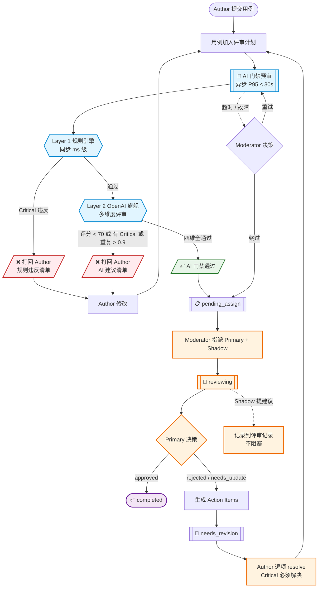

# 测试管理平台-用例评审角色职责需求方案（v0.2）

> 版本：**v0.2 草案（2026-04-23）**
> 项目：Aisight（后端 TestPilot / 前端 TestFront）
> 适用对象：产品、研发、测试、QA 架构师
> 文档定位：基于 IEEE 1028 / Fagan Inspection 角色理论，按"**AI 初步评审 → 人工评审**"的两阶段流水线，规划用例评审模块的角色分工、权限矩阵、状态机扩展与 AI 门禁能力。本方案基于产品使用场景驱动（见附录 C），工程量中等，分 2 期落地。
>
> **v0.2 变更**（相对 v0.1）：
> - ❌ **砍掉 SME / Auditor / 能力画像**（复杂度/法律风险，非成本原因）
> - ❌ **砍掉 13 态状态机** → 精简为 6 态
> - ✅ **恢复 AI Layer 2 完整能力**（覆盖度/边界/可自动化性/术语/重复度）- 用户明确不计 AI 成本，使用 OpenAI 旗舰模型
> - ✅ **AI 升级为"门禁性"**（阻塞流程）而非"建议性"
> - ✅ **新增附录 C 产品使用场景**（钱包支付 V3）
>
> 关联文档：
> - `TestPilot/docs/测试管理平台-用例评审模块需求方案-20260404.md`（v1 基线，保留不动）
> - `TestPilot/docs/测试管理平台-用例评审模块MySQL表结构SQL草案-20260404.md`（需出 v2 修订版，不在本次范围）
> - `TestPilot/docs/测试管理平台-用例评审模块OpenAPI接口文档-20260404.md`（需出 v2 修订版，不在本次范围）
> - `TestPilot/docs/测试管理平台-测试智编模块权限矩阵定稿表-20260328.md`（权限矩阵格式参考）
> - `TestPilot/internal/model/models.go`（全局角色定义）

---

## 0. 执行摘要

当前用例评审模块只有「评审人 = reviewer_id」的单一角色概念，本方案升级为**两阶段协作模型**：

### 核心设计

1. **四角色协作**（非 7 角色）：
   - **Moderator**（评审组织者，1 人/计划）
   - **Author**（用例作者，取 `test_cases.created_by`）
   - **Primary Reviewer**（主评人，1 人/评审项，决策者）
   - **Shadow Reviewer**（陪审，0-N 人/评审项，建议）
   - **AI Pre-Reviewer**（系统自动，见下）

2. **AI 初步评审作为门禁**（非建议）：
   - **Layer 1 规则引擎**（ms 级，零成本）：格式/必填/模糊词
   - **Layer 2 OpenAI 旗舰多维度评审**：质量评分 + 覆盖度 + 边界 + 可自动化性 + 术语 + 重复度
   - **四维门禁**：全部通过才进入人工评审，否则直接打回 Author

3. **不新增全局角色**：角色定义为"评审计划内部字段"，通过 `case_review_item_reviewers.review_role` 区分 primary/shadow，保持全局角色体系稳定。

4. **精简状态机**：从当前 4 态扩展到 6 态（新增 `pending_assign` 和 `needs_revision`），不做 13 态过度设计。

5. **数据模型小改**：改 3 张现有表 + 新增 2 张表（`case_review_defects` 存 action items、`case_review_ai_reports` 存 AI 报告）。

6. **Author 自审禁止**：硬阻止，允许项目级豁免（`project_settings.allow_self_review`）。

### 明确不做

| 不做项 | 理由 |
|---|---|
| SME（领域专家邀请机制） | 复杂度高，用得少 |
| Auditor（审计人） | 国内中小团队无专职审计岗位 |
| 评审人能力画像 | 劳动法风险，数据一旦存在易被滥用 |
| 13 态状态机 | 过度设计 |
| `case_review_audits` / `terminology` / `checklists` 独立表 | 可先用 JSON 配置存 |

### 核心价值

从"流程跑通"升级为"**AI 把关低质量 + 人工聚焦决策 + 驳回闭环可追溯**"：

- AI 拦截约 **25-40%** 低质用例，评审人从格式问题中解放
- 评审人采纳率数据反馈回 AI prompt 迭代
- 驳回产生结构化 action items，避免"改一下再提交"的模糊循环
- Diff-only 二次评审，降低重审成本 **60%+**

**典型场景见附录 C**（钱包支付 V3 红包支付用例评审）。

---

## 1. 背景与目标

### 1.1 当前痛点

基于 `测试管理平台-用例评审模块需求方案-20260404.md` 的基线分析，当前用例评审存在以下局限：

| 局限 | 具体表现 |
|---|---|
| 角色单一 | 评审人只有"reviewer"一种身份，无主次、无陪审、无组织者 |
| 模式粗糙 | `single/parallel` 两种模式由创建者主观选择，与用例风险无关 |
| 反馈非结构化 | 驳回只有一个自由文本 `comment`，无法沉淀缺陷类型分布 |
| 无前置过滤 | 所有用例都要人工评审，低质用例也挤占评审人时间 |
| 无闭环追踪 | 驳回后作者修改是否真的命中问题？无法确认，只能"再评一次" |
| 无审计机制 | 评审人自身质量不可度量，漏检的用例没有追溯 |
| 无 AI 协作 | 重复度检测、覆盖度对照、边界建议完全靠人 |

### 1.2 设计目标

本方案要达成以下目标：

1. **职责清晰**：每个评审参与者的身份、职责、权限、行为边界有明确定义
2. **质量可度量**：评审覆盖率、缺陷检出率、漏检率、评审效率 4 个核心指标可统计
3. **责任可追溯**：从用例创建到归档的完整 timeline 不可删改，满足合规审计
4. **AI 可协作**：AI 负责确定性任务（格式、重复度、覆盖度对照），人类负责业务判断
5. **渐进落地**：不要求一次性大改，有 MVP → 完整版的明确迭代路径

### 1.3 非目标

本方案**不涉及**：

- 代码评审（归 AI Script 模块）
- 测试执行结果的评审（归测试计划模块）
- 缺陷生命周期管理（归缺陷管理模块）
- 用户权限的全局重构（仍沿用现有 6 角色体系）

---

## 2. 术语与角色词典

### 2.1 评审理论术语

| 术语 | 英文 | 来源 | 说明 |
|---|---|---|---|
| 软件评审 | Software Review | IEEE 1028 | 对软件制品的正式检查活动 |
| 检查 | Inspection | IEEE 1028 | 最严格的评审类型，有 checklist 和 defect log |
| 走查 | Walk-through | IEEE 1028 | 作者主导讲解，用于传递知识 |
| 技术评审 | Technical Review | IEEE 1028 | 验证制品符合规格和规范 |
| 管理评审 | Management Review | IEEE 1028 | 评估进度、资源、风险 |
| Fagan 评审 | Fagan Inspection | IBM 1976 | 最早的正式评审方法论，奠定角色分工 |
| ODC | Orthogonal Defect Classification | IBM 1992 | 结构化缺陷分类体系 |
| 缺陷检出率 | Defect Detection Rate | TMMi | 评审发现 / (评审发现 + 执行发现) |
| 评审速度 | Inspection Rate | Fagan | 单位时间评审的制品量，超过阈值漏检率飙升 |

### 2.2 系统内部术语

| 术语 | 对应字段 | 说明 |
|---|---|---|
| 评审计划 | `case_reviews` | 顶层业务实体，一次评审活动 |
| 评审项 | `case_review_items` | 计划下的单个用例，每个用例独立状态 |
| 评审人分配 | `case_review_item_reviewers` | 评审项 × 评审人的中间表 |
| 评审记录 | `case_review_records` | append-only 的评审意见留痕 |
| 评审附件 | `case_review_attachments` | 评审过程中的证据文件 |
| 用例主表回写 | `test_cases.review_result` | 评审通过后回写到用例主表的投影字段 |

### 2.3 新引入术语（本方案新增）

| 术语 | 英文 | 说明 |
|---|---|---|
| 评审组织者 | Moderator | 负责评审计划的组织、节奏、质量兜底 |
| 主评人 | Primary Reviewer | 评审项的决策者，一个评审项只有一个 |
| 陪审 | Shadow Reviewer | 提供意见但不参与决策，多人 |
| AI 预审员 | AI Pre-Reviewer | 自动化评审引擎，作为门禁阻塞低质用例进入人工评审 |
| 行动项 | Action Item | 驳回/AI 门禁失败产生的可追踪修复任务 |
| 自审 | Self-Review | 用例作者评审自己的用例（默认禁止，项目级可豁免） |
| 领域专家 | SME / Subject Matter Expert | *v0.2 不做* 特定模块被邀请的专家 |
| 审计人 | Auditor | *v0.2 不做* 对已完成评审做抽样复核 |
| 评审回测 | Review Audit | *v0.2 不做* 对评审质量本身的抽样检查 |
| 缺陷分类 | Defect Category | *v0.2 不做* 驳回时的结构化缺陷枚举（Phase 2 按数据分布再引入） |

---

## 3. 评审角色抽象模型

### 3.1 角色全景图

```
┌─────────────────────────────────────────────────────────┐
│                    评审计划 (case_review)                │
│                                                         │
│  ┌───────────┐                                          │
│  │ Moderator │── 创建、指派、兜底                        │
│  └─────┬─────┘                                          │
│        │                                                │
│        │ 指派                                           │
│        ↓                                                │
│  ┌──────────────────────────────────────────────────┐   │
│  │            评审项 (case_review_item)              │   │
│  │                                                   │   │
│  │   ┌──────────┐    ┌───────────┐    ┌──────────┐  │   │
│  │   │  Author  │ ─> │  AI Pre-  │ ─> │ Primary  │  │   │
│  │   │  (提交)   │    │ Reviewer  │    │ Reviewer │  │   │
│  │   └──────────┘    │ (门禁预审) │    │ (决策)    │  │   │
│  │                   └───────────┘    └────┬─────┘  │   │
│  │                                         │        │   │
│  │                                         ↓        │   │
│  │                                  ┌──────────┐    │   │
│  │                                  │  Shadow  │    │   │
│  │                                  │ Reviewer │    │   │
│  │                                  │  (建议)   │    │   │
│  │                                  └──────────┘    │   │
│  └──────────────────────────────────────────────────┘   │
└─────────────────────────────────────────────────────────┘

说明：
- SME / Auditor 已从方案中移除（见 §0 执行摘要）
- AI Pre-Reviewer 是门禁角色：不通过直接打回 Author，不进人工评审
```

### 3.2 五种评审角色的详细职责

#### 3.2.1 Moderator（评审组织者）

**职责**：
- 创建评审计划，选择评审模式
- 指派 Primary Reviewer、Shadow Reviewer
- 监督评审节奏，对超时未评审的项主动催办或重派评审人
- 关闭计划前确认所有评审项已完结

**禁止**：
- 不能自己作为该计划的 Reviewer（任何身份）
- 不能修改评审人已提交的记录

**可更改**：Moderator 默认不可改派，但 admin 可介入改派（离职/交接/长假等场景），留审计日志。

**数量**：每个评审计划**必须恰好 1 人**

**对应系统角色**：`manager` 优先 / `tester` 兜底（admin 有全局权限，不推荐作为常规 Moderator）

---

#### 3.2.2 Author（用例作者）

**职责**：
- 用例的创建、修改
- 响应驳回：按 action items 逐项修复，可对某条提出异议（附理由）
- 对 AI 预审建议选择性采纳（用于修改阶段）
- 不主动提交评审（评审计划由 Moderator 发起；但 Author 可把用例加入已有计划）

**禁止**：
- **不能评审自己创建的用例**（硬约束，后端 403 拒绝）
- **例外**：项目配置 `project_settings.allow_self_review=true` 时允许（小团队场景），需 admin 批准开启
- 不能看到其他评审人的评审意见直到评审完成（避免被影响）

**数量**：每个用例 1 人，取 `test_cases.created_by`

**对应系统角色**：任意可创建用例的角色（`admin / manager / tester`）

---

#### 3.2.3 Primary Reviewer（主评人）

**职责**：
- 评审项的**最终决策**（approve / reject / needs_update）
- 撰写结构化评审意见（必填 severity；Phase 2 可扩展 defect_categories）
- 对驳回负责：意见会转化为 action items 清单
- 二次评审时 diff-only 复核（只看 Author 修改的部分）
- 对 AI 预审建议选择「采纳/拒绝/不确定」，反馈回流用于 prompt 迭代

**禁止**：
- 不能评审自己创建的用例
- 不能修改其他 Primary Reviewer 已提交的记录（评审记录 append-only）

**数量**：每个评审项**恰好 1 人**（后端唯一索引保证）

**对应系统角色**：`reviewer` 优先 / `tester` 可升任 / `manager` 按需兜底

---

#### 3.2.4 Shadow Reviewer（陪审）

**职责**：
- 独立检查，提出建议性意见（不阻塞流程）
- 可对 Primary 的决策提出异议（记录异议但不触发复杂仲裁，Moderator 知会）
- 评审意见作为"建议"而非"决策"，不影响评审项状态流转

**禁止**：
- 不能单独决定评审项的 final_result
- 不能评审自己创建的用例
- 不能同时是同一评审项的 Primary

**数量**：每个评审项 **0-N 人**

**对应系统角色**：`reviewer / tester / developer`

---

#### 3.2.5 AI Pre-Reviewer（AI 门禁预审）

**职责**：
- 在人工评审前完成**两层检查**：
  - **Layer 1 规则引擎**（同步、ms 级、零成本）：格式、必填、长度、模糊词
  - **Layer 2 OpenAI 旗舰模型多维度评审**（异步、~15-30s）：
    1. 质量评分（0-100）
    2. 覆盖度对照（需求文档 RAG，若有关联需求）
    3. 边界/异常路径建议
    4. 可自动化性评估
    5. 术语一致性
    6. 重复度检测（LLM 扫描近期 N 条用例）
- 产出 AI 评审报告，写入 `case_review_ai_reports`
- 按门禁规则判定：**四维全部通过则放行**，否则打回 Author

**AI 门禁判定**（全部满足才放行）：
- `quality_score ≥ 70`
- `coverage_score ≥ 80`（若有关联需求文档）
- 无 Critical findings
- 无重复度 > 0.9 的重复用例

**禁止**：
- **不能做 approve/reject 决策**（责任必须落到自然人）
- 不能独立完成评审项
- 不能绕过人工评审流程（Moderator 可绕过 AI，但不能绕过 Primary）

**异常降级**：LLM 超时 30s / API 故障时，标记 `ai_status=timeout`，由 Moderator 决定绕过或重试。

**数量**：系统级服务，每个评审项自动触发 1 次

**对应系统角色**：系统自动执行，不占用人类角色

### 3.3 五角色权威强度对比

| 角色 | 决策权 | 必须存在 | 可否多人 |
|---|:---:|:---:|:---:|
| Moderator | 管理层决策 | ✅ 必须 1 人 | ❌（恰好 1） |
| Author | 无 | ✅ 必须 1 人（= 用例创建者） | ❌（恰好 1） |
| Primary Reviewer | 评审决策 | ✅ 必须 1 人 | ❌（恰好 1） |
| Shadow Reviewer | 建议 | ❌ 可选 | ✅ 多人 |
| AI Pre-Reviewer | 门禁阻断 + 建议 | ✅ 系统自动 | — |

---

## 4. 当前系统角色盘点

### 4.1 全局角色（6 个）

定义位置：`TestPilot/internal/model/models.go`

| 常量 | 值 | 显示名 | 当前职责 |
|---|---|---|---|
| `GlobalRoleAdmin` | `admin` | 系统管理员 | 平台级最高权限，可管理所有项目 |
| `GlobalRoleManager` | `manager` | 项目管理员 | 项目级管理，可创建/关闭评审计划 |
| `GlobalRoleTester` | `tester` | 测试工程师 | 创建用例、关联评审、当前可创建评审计划 |
| `GlobalRoleReviewer` | `reviewer` | 评审员 | 当前系统中唯一的"评审人"身份 |
| `GlobalRoleDeveloper` | `developer` | 开发工程师 | 当前仅有查看权限 |
| `GlobalRoleReadonly` | `readonly` | 只读访客 | 纯查看 |

**判定规则**：
- `IsPresetSystemRole(role)` - 判断是否为预置角色（不可删除）
- `IsValidGlobalRole(role)` - 合法性校验
- `IsProtectedGlobalRole(role)` - 受保护角色（`admin` / `manager` 不可从项目移除）

### 4.2 项目成员角色（2 个）

| 常量 | 值 | 说明 |
|---|---|---|
| `MemberRoleOwner` | `owner` | 项目负责人，具备项目层完整控制权 |
| `MemberRoleMember` | `member` | 项目成员，按全局角色决定细粒度权限 |

### 4.3 当前评审相关权限基线

摘自 `测试管理平台-用例评审模块需求方案-20260404.md` §4：

| 能力 | admin | manager | tester | reviewer | developer | readonly |
|---|:---:|:---:|:---:|:---:|:---:|:---:|
| 查看评审计划/评审项/评审记录 | ✅ | ✅ | ✅ | ✅ | ✅ | ✅ |
| 创建/编辑/复制评审计划 | ✅ | ✅ | ✅ | ❌ | ❌ | ❌ |
| 关联/移除用例 | ✅ | ✅ | ✅ | ❌ | ❌ | ❌ |
| 批量改评审人 | ✅ | ✅ | ✅ | ❌ | ❌ | ❌ |
| 批量重新提审 | ✅ | ✅ | ✅ | ❌ | ❌ | ❌ |
| 删除/关闭评审计划 | ✅ | ✅ | ❌ | ❌ | ❌ | ❌ |
| 单条评审/批量评审 | ✅ | ✅ | ❌ | ✅ | ❌ | ❌ |

### 4.4 当前权限基线的不足

1. **`tester` 创建计划 + `reviewer` 做评审**——分工过粗，两者没有协作机制
2. **无 Moderator 概念**——计划创建者默认承担所有组织职责，但没有明确的责任边界
3. **Author 可以给自己创建的用例做评审**——若 Author 同时是 reviewer 身份，当前无硬阻止
4. **AI 协作缺失**——没有自动化预审，低质用例全部涌入人工评审流程
5. **反馈非结构化**——驳回仅有自由文本，无 severity / action items，无法做数据回归分析

---

## 5. 评审角色 → 系统角色映射表

### 5.1 核心映射表

| 评审理论角色 | 系统全局角色推荐 | 数据归属 | 是否可由 admin 兜底 |
|---|---|---|:---:|
| Moderator | `manager` 优先，`tester` 次之 | `case_reviews.moderator_id` | ✅ |
| Author | `admin / manager / tester` | `test_cases.created_by` | — |
| Primary Reviewer | `reviewer` 优先，`tester` / `manager` 次之 | `case_review_item_reviewers.review_role = 'primary'` | ✅ |
| Shadow Reviewer | `reviewer / tester / developer` | `case_review_item_reviewers.review_role = 'shadow'` | ❌ 不建议 |
| AI Pre-Reviewer | 系统服务，不占用人类角色 | `case_review_ai_reports` 表 | — |

### 5.2 映射原则

#### 5.2.1 不新增全局角色

**原因**：全局角色体系已稳定服务整个平台（用例管理、智编、项目管理），不应为评审模块单独扩张。评审角色是**计划内部的职责划分**，用字段标记即可。

**后果**：
- 用户的全局角色仍是 `admin/manager/tester/reviewer/developer/readonly` 之一
- 用户能否在某个评审计划中担任 Primary Reviewer，由**被指派时的 role 字段**决定，不由全局角色自动赋予

#### 5.2.2 全局角色决定"可否担任"，不决定"一定担任"

| 全局角色 | 可担任的评审角色 |
|---|---|
| `admin` | Moderator / Primary / Shadow（任意，通常不担任 Author） |
| `manager` | Moderator / Primary / Shadow |
| `tester` | Author / Moderator / Primary / Shadow |
| `reviewer` | Primary / Shadow（该角色定位是专职评审，不推荐作 Author） |
| `developer` | Shadow（作为业务顾问参与） |
| `readonly` | 仅查看，不可担任任何评审角色 |

#### 5.2.3 互斥约束

一个用户在同一个评审项中**不能**同时担任多个角色。具体规则：

| 冲突 | 阻断机制 | 例外 |
|---|---|---|
| Author + 任意 Reviewer 角色（自审） | 后端硬阻止（403） | `project_settings.allow_self_review=true` 时放行 |
| Moderator + 本计划的任何 Reviewer | 后端硬阻止（403） | 无 |
| Primary + Shadow（同项） | 前端禁止 + 后端校验 | 无 |
| 同一用户在同一项多次被指派同角色 | 唯一索引保证 | 无 |

### 5.3 映射示例

**示例 A：典型功能用例评审（单评）**

```
评审计划: 支付模块 V3 用例评审（15 条 P1 用例）
  Moderator: 张三（manager）

  评审项 #1 用例「微信支付成功」
    Author: 李四（tester，用例创建者）
    AI Pre-Reviewer: [系统自动，四维门禁]
    Primary Reviewer: 王五（reviewer）
    Shadow Reviewer: 无
```

**示例 B：关键安全用例的严格评审（主评 + 陪审）**

```
评审计划: 登录/鉴权用例评审（P0）
  Moderator: 张三（manager）

  评审项 #2 用例「密码错误 5 次后账户锁定 30min」
    Author: 李四（tester）
    AI Pre-Reviewer: [系统自动]
    Primary Reviewer: 王五（reviewer）
    Shadow Reviewer: 赵六（reviewer）, 周八（tester）  ← 严格把关，2 名陪审
```

**示例 C：涉及第三方集成的评审（开发作为陪审）**

```
评审计划: 第三方集成用例评审
  Moderator: 张三（manager）

  评审项 #5 用例「微信授权登录回调异常处理」
    Author: 李四（tester）
    AI Pre-Reviewer: [系统自动]
    Primary Reviewer: 王五（reviewer）
    Shadow Reviewer: 钱九（developer，该模块开发 owner）  ← 开发以陪审身份提供领域视角
```

**说明**：SME 和 Auditor 在 v0.2 已移除；复杂场景下由"多 Shadow Reviewer"覆盖领域专家和复核需求。

---

## 6. 评审生命周期状态机（精简 6 态）

### 6.1 当前状态机（4 态）

```
pending ──> reviewing ──> completed
                │
                └──> (通过驳回) ──> pending   ← 无法区分"待评"和"要改"
                                                                                                            
另有终态：closed（计划整体关闭时评审项一并关闭）
```

**问题**：驳回后重回 `pending`，Author 和 Moderator 都不知道"这是新用例"还是"要改的用例"。

### 6.2 目标状态机（6 态）

```
            ┌──────────────────────────── (Author 从 needs_revision 改完重提) ─┐
            │                                                                    │
            ↓                                                                    │
     ┌─────────┐       AI 门禁通过        ┌────────────────┐                    │
     │ pending │ ─────────────────────>  │ pending_assign │                    │
     └─────────┘                          └────────┬───────┘                    │
         │                                         │                            │
         │ AI 门禁不通过                           │ Moderator 指派 Primary      │
         └─> 打回 Author 修改                      ↓                            │
             (状态保持 pending)              ┌───────────┐                      │
                                             │ reviewing │                      │
                                             └─────┬─────┘                      │
                                                   │                            │
                               ┌───────────────────┼───────────────────┐        │
                               ↓                   ↓                   ↓        │
                          approved            rejected /         needs_update   │
                               │            needs_update             │         │
                               ↓                   │                   │        │
                         ┌───────────┐             ↓                   ↓        │
                         │ completed │      ┌─────────────────┐                │
                         └───────────┘      │ needs_revision  │ ───────────────┘
                                            │ (Action Items)  │
                                            └─────────────────┘

                         ┌──────────┐
                         │  closed  │  ← 计划关闭时所有未完成项进入此态
                         └──────────┘
```

### 6.3 6 态语义和退出条件

| 状态 | 语义 | 进入条件 | 退出条件 |
|---|---|---|---|
| `pending` | 待 AI 门禁预审 | 用例加入评审计划；或 Author 从 `needs_revision` 改完重提 | AI 门禁通过 → `pending_assign`；不通过 → 保持 `pending` 并通知 Author 修改 |
| `pending_assign` | AI 通过，等 Moderator 指派 Primary | AI 门禁全部通过 | Moderator 指派 Primary 后进入 `reviewing` |
| `reviewing` | Primary 评审中 | Moderator 指派 Primary | Primary 提交决策 |
| `needs_revision` | 驳回/需修改，含 Action Items | Primary 决策为 `rejected` 或 `needs_update`，系统自动生成 action items | Author 完成所有 Critical action items 后重提 → `pending`（二次评审 diff-only） |
| `completed` | 已通过，闭环 | Primary 决策 `approved` | 终态（除非计划被手动关闭） |
| `closed` | 已关闭 | 计划手动关闭 / 用例从计划移除 | 终态 |

### 6.4 状态转换规则

| 起始 → 目标 | 触发者 | 前置条件 |
|---|---|---|
| 创建评审项 → `pending` | Moderator（加入用例） / Author（主动加入） | 无 |
| `pending` → `pending_assign` | System | Layer 1 + Layer 2 四维门禁全部通过 |
| `pending` → `pending`（AI 打回） | System | 门禁任一项不通过；通知 Author |
| `pending_assign` → `reviewing` | Moderator | 已指派 Primary Reviewer |
| `reviewing` → `completed` | Primary Reviewer | 决策 = `approved` |
| `reviewing` → `needs_revision` | Primary Reviewer | 决策 ∈ {`rejected`, `needs_update`}；必填 severity；系统生成 action items |
| `needs_revision` → `pending` | Author | 所有 Critical action items 已 resolve；重新提交触发 AI 二次评审 |
| 任意 → `closed` | Moderator / admin | 计划关闭或用例从计划移除 |

### 6.5 关键设计决策

#### 决策 1：不引入 `auto_checking` / `auto_check_failed` 等中间态

**原因**：AI 门禁结果用 `case_review_items.ai_gate_status`（枚举 `not_started / passed / failed / timeout`）单独存储，不污染主状态机。UI 上通过"AI 门禁徽章"展示，与主状态解耦。

#### 决策 2：AI 门禁不通过时保持 `pending` 不变

**原因**：避免新增 `auto_check_failed` 态。Author 从"通知"或"面板"看到 AI 打回原因即可，主状态仍是 `pending`（语义：待评审未开始）。

#### 决策 3：不区分 `rejected` / `needs_update` 为不同态

**原因**：对 Author 而言两者的操作完全一致（看 action items → 逐项修复 → 重提）。在 `case_review_records.result` 字段里区分语义即可，状态机统一为 `needs_revision`。

#### 决策 4：不引入 `audited` / `archived` 态

**原因**：Auditor 机制在 v0.2 移除；`archived` 场景用 `closed` 替代即可。

### 6.6 向下兼容

**现状**：后端模型已有 `pending / reviewing / completed` 三态以及计划级 `closed`。

**过渡策略**：
1. **Phase 1**：新增 `pending_assign` 和 `needs_revision` 两态，`pending` 含义保持不变（"待评审"）
2. **数据迁移**：存量数据全部保持 `pending`，不做回填
3. **UI 改造**：前端增加 2 个状态标签和对应配色（见 §12.5），老标签保留不变
4. **API 兼容**：列表接口新增可选过滤参数 `status=pending_assign|needs_revision`，老调用方不传则默认所有状态

---

## 7. 各评审环节的角色分工

### 7.1 环节总览（AI 门禁 → 人工评审主线）

```
[创建计划] → [加入用例] → [AI 门禁预审] ──门禁通过──> [指派评审人] → [人工评审]
                               │                                         │
                               │ 门禁不通过                                │
                               ↓                                         ↓
                          [通知 Author]                          [决策分支]
                               │                                   │    │
                               ↓                          approved │    │ rejected/needs_update
                          [Author 修改]                             ↓    ↓
                               │                            [completed]  [needs_revision]
                               │                                              │
                               └─────────────────────────────────────────────┤
                                    (Author resolve action items 后重提)      │
                                                                             │
                                              [二次评审 (diff-only)] <────────┘
```

完整流程图见 **附录 C §C.2 整体流程图（Mermaid 版）**。

### 7.2 环节 1：创建评审计划

| 动作 | 负责角色 | 系统校验 |
|---|---|---|
| 填写计划名称、计划时间 | Moderator（创建者） | 必填校验 |
| 选择评审模式（`single` / `parallel`） | Moderator | 枚举校验，兼容 v1 |
| 指定 Moderator | System 自动 | 默认为创建者，写入 `case_reviews.moderator_id` |
| 可选：预置 default_reviewer_ids | Moderator | 至少不包含自己 |
| 可选：勾选"启用 AI 门禁" | Moderator | 默认启用 |

**权限**：`admin / manager / tester` 可创建

**Moderator 改派规则**：默认不可改，admin 可介入改派（留审计日志）。

### 7.3 环节 2：加入用例到计划

| 动作 | 负责角色 | 系统校验 |
|---|---|---|
| 单个/批量选择用例加入 | Moderator / Author（Author 可把自己的用例加入已有计划） | 用例必须属于同项目 |
| 系统为每个用例生成 case_review_item，状态 `pending` | System | — |
| 用例主表回写 `review_result = 待评审`（如启用 auto_submit） | System | — |
| 异步触发 AI 门禁预审 | System | — |

### 7.4 环节 3：AI 门禁预审（关键环节）

**触发时机**：评审项进入 `pending` 状态后立即异步触发。

**Layer 1 规则引擎**（同步，ms 级）：

| 检查项 | 严重度 |
|---|---|
| 标题非空且长度 10-80 字符 | Critical |
| 步骤至少 2 步 | Critical |
| 期望结果非空 | Critical |
| 前置条件非空 | Major |
| 单步 ≤ 200 字符 | Major |
| 期望不含模糊词（"正常"/"应该"/"大概"/"没问题"） | Major |

**Layer 2 AI 多维度评审**（异步，~15-30s，OpenAI 旗舰模型）：

| 维度 | 产出字段 | 是否影响门禁 |
|---|---|:---:|
| 质量评分 | `quality_score` 0-100 | ✅ |
| 覆盖度对照（若有关联需求） | `coverage_score` 0-100 + 未覆盖场景列表 | ✅（若有需求） |
| 边界/异常路径建议 | 建议用例列表 | ❌ 仅提示 |
| 可自动化性评估 | `automation_score` + 推荐框架 | ❌ 仅提示 |
| 术语一致性 | 不规范术语列表 | ❌ 仅提示（Major） |
| 重复度检测 | 最相似用例 + 相似度 | ✅ |

**AI 门禁判定**（四维全通过才放行）：

```
✓ quality_score ≥ 70
✓ coverage_score ≥ 80 (若有关联需求)
✓ 无 Critical findings
✓ 无重复度 > 0.9 的重复用例
```

**门禁不通过**：
- 评审项保持 `pending` 状态（不新增中间态）
- `ai_gate_status = failed`
- 生成 Author 端 action items（AI 来源）
- 通知 Author

**门禁通过**：
- 评审项转 `pending_assign`
- `ai_gate_status = passed`
- AI 报告写入 `case_review_ai_reports`，附到评审项

**异常降级**：LLM 超时 30s / API 故障 → `ai_gate_status = timeout`，Moderator 可手动重试或**绕过 AI 门禁**直接进入 `pending_assign`（留审计日志）。

### 7.5 环节 4：Moderator 指派评审人

| 动作 | 负责角色 | 系统校验 |
|---|---|---|
| 为评审项指派 Primary Reviewer | Moderator | ① 不能是 Author（除非豁免）② 不能是 Moderator 自己 ③ 必须是项目成员 |
| 为评审项指派 0-N 个 Shadow Reviewer | Moderator | ① 不能与 Primary 重复 ② 不能是 Author ③ 必须是项目成员 |

**批量快捷操作**：
- 从计划的 `default_reviewer_ids` 批量指派为 Primary
- 下拉列表自动过滤 Author 和 Moderator

**状态转换**：评审项从 `pending_assign` → `reviewing`

### 7.6 环节 5：人工评审

#### 7.6.1 Primary Reviewer 评审

**界面包含**：用例内容 + AI 预审报告（各维度评分 + findings） + 每条 AI 建议的采纳按钮

| 步骤 | 必填 |
|---|:---:|
| 查看用例内容 + AI 预审报告 | — |
| 对每条 AI 建议选择「采纳 / 拒绝 / 不确定」 | AI 建议反馈（若有 AI 报告） |
| 给出决策：`approved` / `rejected` / `needs_update` | ✅ |
| 填写 severity：`critical` / `major` / `minor` | ✅ |
| 填写 comment（文本意见） | ✅ |
| 可选：列出 suggested_actions（Phase 2 引入结构化 defect_categories） | ❌ |

**提交评审 API 契约示例**：
```json
{
  "decision": "rejected",
  "severity": "major",
  "comment": "缺少权限边界用例；期望「应该正常」无法程序判定",
  "suggested_actions": [
    {"title": "新增未授权用户访问测试"},
    {"title": "期望改为具体响应码/文案"}
  ],
  "ai_feedback": [
    {"ai_finding_id": "coverage_01", "action": "accepted"},
    {"ai_finding_id": "boundary_02", "action": "rejected"}
  ]
}
```

#### 7.6.2 Shadow Reviewer 评审

**区别于 Primary**：
- 产出为**建议**而非**决策**，不影响评审项状态流转
- 即使 Primary 已 `approved`，Shadow 仍可追加建议（记入评审记录）
- 可对 Primary 决策提异议（仅记录，不触发复杂仲裁流程；Moderator 收到通知决定是否重派 Primary）

**提交接口**：单独的"Shadow 提建议"API，不走 Primary 的提交决策路径。

### 7.7 环节 6：驳回处理（闭环）

#### 7.7.1 驳回时系统动作

| 动作 | 触发者 | 数据变更 |
|---|---|---|
| 评审项 `reviewing` → `needs_revision` | Primary Reviewer | `case_review_items.status` 更新 |
| 为每条 suggested_action 生成 `case_review_defects` 记录 | System | 新增 N 条 action items |
| AI 门禁不通过的 action items 同样归入 `case_review_defects` | System | 来源标记 `source=ai_gate` vs `primary_review` |
| 通知 Author | System | 站内消息 + 邮件（可配） |

#### 7.7.2 Author 端 Action Items 面板

| 规则 | 说明 |
|---|---|
| 按严重度分组：Critical / Major / Minor | Critical 必须 resolve，Major 可暂缓，Minor 自愿 |
| 逐条 resolve + 填写修复说明 | 调用 `POST /defects/:id/resolve` |
| 可对某条 action item 提异议 | 附理由，状态转 `disputed`；Primary 需二次判断 |
| 所有 Critical resolve 后才能重提 | 后端硬校验 |

#### 7.7.3 重提触发二次 AI 门禁

Author 重提后：
1. 评审项状态 `needs_revision` → `pending`
2. 异步触发 AI 门禁**二次预审**（可配置仅跑变更部分，节省 token）
3. 门禁通过 → `pending_assign`（Moderator 无需再次指派，保持原 Primary）
4. Primary 进入**diff-only 模式**评审：只展示变更部分，已 resolved 的 action items 默认采信

### 7.8 环节 7：闭环完成

| 条件 | 动作 |
|---|---|
| Primary 决策 `approved` | 评审项转 `completed` |
| 所有评审项完成 | 计划状态 `in_progress` → `completed` |
| 用例主表回写 | `test_cases.review_result = 已通过` |
| 发送汇总通知 | 通知 Moderator / Author 计划完成 |

**注**：v0.2 不做审计抽样，也不做评审人能力画像（见 §0 明确不做项）。

### 7.9 异常处理

| 异常 | 处理 |
|---|---|
| AI Layer 2 超时 / LLM 故障 | `ai_gate_status = timeout`，Moderator 可手动重试或绕过 |
| Primary 长期不评审 | Moderator 可重派；系统在超时阈值（可配）后发提醒 |
| Author 无响应 action items | Moderator 可关闭评审项或换 Author（需 admin 介入） |
| Shadow 提异议但 Primary 不改决策 | 仅记录，Moderator 知会；不触发复杂仲裁 |

---

## 8. 权限矩阵

### 8.1 核心权限矩阵（按全局角色切片）

> 注：**有"（作为 Moderator）"标注的能力**，除了全局角色要求外，还需 current_user 是该计划的 Moderator；admin 可绕过 Moderator 身份要求。

| 能力 | admin | manager | tester | reviewer | developer | readonly |
|---|:---:|:---:|:---:|:---:|:---:|:---:|
| **计划管理** | | | | | | |
| 创建评审计划 | ✅ | ✅ | ✅ | ❌ | ❌ | ❌ |
| 编辑评审计划（作为 Moderator） | ✅ | ✅ | ✅ | ❌ | ❌ | ❌ |
| 关闭评审计划（作为 Moderator） | ✅ | ✅ | ❌ | ❌ | ❌ | ❌ |
| 删除评审计划（作为 Moderator，未开始或无记录） | ✅ | ✅ | ❌ | ❌ | ❌ | ❌ |
| 复制评审计划 | ✅ | ✅ | ✅ | ❌ | ❌ | ❌ |
| 改派 Moderator | ✅ | ❌ | ❌ | ❌ | ❌ | ❌ |
| **评审项管理** | | | | | | |
| 加入用例到计划（作为 Moderator / Author） | ✅ | ✅ | ✅ | ❌ | ❌ | ❌ |
| 移除用例（作为 Moderator） | ✅ | ✅ | ✅ | ❌ | ❌ | ❌ |
| 手动触发 AI 门禁重跑（作为 Moderator） | ✅ | ✅ | ✅ | ❌ | ❌ | ❌ |
| 绕过 AI 门禁（作为 Moderator，AI 超时/故障时） | ✅ | ✅ | ✅ | ❌ | ❌ | ❌ |
| **评审人指派** | | | | | | |
| 指派 Primary Reviewer（作为 Moderator） | ✅ | ✅ | ✅ | ❌ | ❌ | ❌ |
| 指派 Shadow Reviewer（作为 Moderator） | ✅ | ✅ | ✅ | ❌ | ❌ | ❌ |
| 重派评审人（作为 Moderator） | ✅ | ✅ | ✅ | ❌ | ❌ | ❌ |
| **评审执行** | | | | | | |
| 作为 Primary Reviewer 评审 | ✅ | ✅ | ✅ | ✅ | ❌ | ❌ |
| 作为 Shadow Reviewer 提建议 | ✅ | ✅ | ✅ | ✅ | ✅ | ❌ |
| 对 Primary 决策提异议（作为 Shadow） | ✅ | ✅ | ✅ | ✅ | ✅ | ❌ |
| 对 AI 建议反馈（采纳/拒绝/不确定） | ✅ | ✅ | ✅ | ✅ | ✅ | ❌ |
| **Author 动作** | | | | | | |
| Resolve Action Item（作为 Author） | ✅ | ✅ | ✅ | ✅ | ✅ | ❌ |
| 对 Action Item 提异议（作为 Author） | ✅ | ✅ | ✅ | ✅ | ✅ | ❌ |
| 重新提交（作为 Author，所有 Critical resolve 后） | ✅ | ✅ | ✅ | ✅ | ✅ | ❌ |
| **查看** | | | | | | |
| 查看评审计划/评审项 | ✅ | ✅ | ✅ | ✅ | ✅ | ✅ |
| 查看 AI 预审报告 | ✅ | ✅ | ✅ | ✅ | ✅ | ✅ |
| 查看评审时间线 | ✅ | ✅ | ✅ | ✅ | ✅ | ✅ |
| 查看 Action Items 面板 | ✅ | ✅ | ✅ | ✅ | ✅ | ✅ |
| **配置** | | | | | | |
| 设置项目级 `allow_self_review` 豁免 | ✅ | ❌ | ❌ | ❌ | ❌ | ❌ |

**说明**：v0.2 不做 SME / Auditor / 能力画像 / 独立术语表 / 独立 checklist，因此上表已剔除对应能力。

### 8.2 跨角色互斥约束矩阵

| 约束 | 后端阻断规则 | 错误码 | 例外 |
|---|---|---|---|
| Author 不能是本评审项的 Primary/Shadow | `if item.created_by == reviewer.user_id: return 403` | `CodeReviewSelfReviewForbidden` | `project_settings.allow_self_review=true` |
| Moderator 不能是本计划的任何 Reviewer | `if reviewer.user_id == plan.moderator_id: return 403` | `CodeReviewModeratorConflict` | 无 |
| Primary 不能同时是同项 Shadow | `if same_user_id in (primary, shadow): return 403` | `CodeReviewRoleConflict` | 无 |
| 同项不能有 2 个 Primary | `UNIQUE INDEX (review_item_id) WHERE review_role='primary'` | DB 约束 | 无 |

### 8.3 项目成员维度约束

**所有评审角色必须先是项目成员**（`user_projects` 表中存在记录），否则无法被指派。

| 项目角色 | 可在本项目担任评审角色 |
|---|---|
| `owner` | 任意 |
| `member` | 按全局角色约束 |
| 非成员 | 不可担任任何评审角色 |

---

## 9. 数据模型改动清单

### 9.1 改动概览（v0.2 精简版）

| 类别 | 表 | 改动 |
|---|---|---|
| 扩展字段 | `case_reviews` | +2 字段（`moderator_id`、`ai_enabled`） |
| 扩展字段 | `case_review_items` | +3 字段（`ai_gate_status`、`ai_report_id`、`revision_round`） |
| 扩展字段 | `case_review_item_reviewers` | +1 字段（`review_role`） |
| 扩展字段 | `case_review_records` | +2 字段（`severity`、`ai_feedback`） |
| 新增表 | `case_review_defects` | Action items 闭环 |
| 新增表 | `case_review_ai_reports` | AI 预审报告存档 |
| 扩展字段 | `project_settings`（或 projects 表 JSON） | +1 字段（`allow_self_review`） |

**v0.2 相对 v0.1 砍掉的表**：
- ❌ `case_review_audits`（Auditor 机制不做）
- ❌ `case_review_terminology`（术语表降级为 project_settings.terminology JSON，后期再独立）
- ❌ `case_review_checklists`（checklist 暂不做，后期按需）

**v0.2 相对 v0.1 砍掉的字段**：
- ❌ `case_reviews.auditor_id` / `review_type` / `risk_level` / `checklist_id`
- ❌ `case_review_item_reviewers.invitation_status` / `decline_reason`（SME 邀请机制不做）

### 9.2 `case_reviews` 扩展

```sql
ALTER TABLE case_reviews 
  ADD COLUMN moderator_id BIGINT UNSIGNED NOT NULL DEFAULT 0 COMMENT 'Moderator 用户 ID',
  ADD COLUMN ai_enabled BOOLEAN NOT NULL DEFAULT TRUE COMMENT '是否启用 AI 门禁预审',
  ADD INDEX idx_cr_moderator (project_id, moderator_id);
```

**字段说明**：
- `moderator_id`：必填，创建时写入 `current_user_id`；改派需 admin 介入
- `ai_enabled`：Moderator 可在创建/编辑时勾选；关闭 AI 后评审项直接进入 `pending_assign`

**数据迁移**：存量计划 `moderator_id = created_by`（如 created_by 用户已 inactive，兜底为项目 owner，再兜底为 admin）

### 9.3 `case_review_items` 扩展

```sql
ALTER TABLE case_review_items 
  ADD COLUMN ai_gate_status VARCHAR(20) NOT NULL DEFAULT 'not_started' 
    COMMENT 'AI 门禁状态: not_started/running/passed/failed/timeout/bypassed',
  ADD COLUMN ai_report_id BIGINT UNSIGNED NULL 
    COMMENT '最近一次 AI 报告 ID，关联 case_review_ai_reports',
  ADD COLUMN revision_round INT NOT NULL DEFAULT 0 
    COMMENT '驳回-修改轮次（每次被驳回 +1）',
  ADD INDEX idx_ri_ai_gate (review_id, ai_gate_status);
```

**关键设计**：AI 门禁状态与评审项主状态（`status`）**解耦**，UI 层通过"AI 门禁徽章 + 主状态标签"双标签展示。

### 9.4 `case_review_item_reviewers` 扩展

```sql
ALTER TABLE case_review_item_reviewers 
  ADD COLUMN review_role VARCHAR(16) NOT NULL DEFAULT 'primary' 
    COMMENT '评审角色: primary / shadow',
  ADD INDEX idx_ir_role (review_item_id, review_role);

-- 同项只能有 1 个 Primary（MySQL 8.0+ 支持函数索引，或 Service 层事务校验）
-- 如数据库不支持部分索引，用 Service 层 txMgr.WithTx 保证唯一性
```

**数据迁移**：存量数据 `review_role = 'primary'`（所有老记录默认为主评人）

### 9.5 `case_review_records` 扩展

```sql
ALTER TABLE case_review_records 
  ADD COLUMN severity VARCHAR(10) NOT NULL DEFAULT 'major' 
    COMMENT '严重度: critical / major / minor',
  ADD COLUMN ai_feedback JSON NULL 
    COMMENT 'AI 建议采纳反馈 [{ai_finding_id, action: accepted/rejected/unsure}]';
```

**设计说明**：
- Phase 1 不引入 `defect_categories` 字段，先积累 `severity` 数据，Phase 2 根据真实分布引入枚举
- `ai_feedback` 用于回流采纳率，驱动 prompt 迭代

### 9.6 新增表 `case_review_defects`（Action Items）

```sql
CREATE TABLE case_review_defects (
  id BIGINT UNSIGNED NOT NULL AUTO_INCREMENT,
  review_id BIGINT UNSIGNED NOT NULL,
  review_item_id BIGINT UNSIGNED NOT NULL,
  record_id BIGINT UNSIGNED NULL COMMENT '触发本缺陷的评审记录；AI 门禁来源时为 NULL',
  source VARCHAR(20) NOT NULL COMMENT '来源: primary_review / ai_gate',
  title VARCHAR(200) NOT NULL COMMENT '缺陷标题（= suggested_action.title）',
  severity VARCHAR(10) NOT NULL COMMENT 'critical / major / minor',
  status VARCHAR(20) NOT NULL DEFAULT 'open' 
    COMMENT 'open / resolved / disputed',
  resolved_by BIGINT UNSIGNED NULL COMMENT '修复人（通常是 Author）',
  resolved_at DATETIME(3) NULL,
  resolution_note VARCHAR(1000) NULL COMMENT '修复说明',
  dispute_reason VARCHAR(1000) NULL COMMENT 'Author 异议理由',
  created_at DATETIME(3) NOT NULL,
  updated_at DATETIME(3) NOT NULL,
  PRIMARY KEY (id),
  KEY idx_crd_review_item (review_item_id, status),
  KEY idx_crd_review (review_id),
  KEY idx_crd_resolver (resolved_by)
) ENGINE=InnoDB DEFAULT CHARSET=utf8mb4 COMMENT='评审缺陷 / Action Items';
```

**Status 枚举**：
- `open`：待 Author 处理
- `resolved`：Author 已修复
- `disputed`：Author 异议中，需 Primary 再判断

### 9.7 新增表 `case_review_ai_reports`

```sql
CREATE TABLE case_review_ai_reports (
  id BIGINT UNSIGNED NOT NULL AUTO_INCREMENT,
  review_item_id BIGINT UNSIGNED NOT NULL,
  round_no INT NOT NULL DEFAULT 1 COMMENT '轮次，每次 submit 新增',

  -- Layer 1 规则引擎结果
  rule_violations JSON NULL COMMENT '规则违反列表',

  -- Layer 2 AI 评审结果
  quality_score INT NULL COMMENT '质量评分 0-100',
  coverage_score INT NULL COMMENT '覆盖度评分 0-100（若有需求文档）',
  coverage_gaps JSON NULL COMMENT '覆盖度缺失场景列表',
  boundary_suggestions JSON NULL COMMENT '边界建议列表',
  automation_score INT NULL COMMENT '可自动化性评分 0-100',
  terminology_issues JSON NULL COMMENT '术语不一致列表',
  duplicate_candidates JSON NULL COMMENT '相似用例列表 [{case_id, similarity}]',
  findings JSON NULL COMMENT 'AI 发现的问题（含 severity / evidence）',
  verdict VARCHAR(20) NULL COMMENT 'AI 总体判断: pass / needs_improvement / reject',

  -- 门禁结果
  gate_passed BOOLEAN NULL COMMENT '门禁是否通过',
  gate_failure_reasons JSON NULL COMMENT '门禁不通过原因列表',

  -- 元数据
  ai_model VARCHAR(50) NULL COMMENT '使用的 AI 模型',
  token_usage INT NULL COMMENT 'token 消耗',
  duration_ms INT NULL COMMENT '耗时（毫秒）',

  created_at DATETIME(3) NOT NULL,
  PRIMARY KEY (id),
  KEY idx_crar_item_round (review_item_id, round_no)
) ENGINE=InnoDB DEFAULT CHARSET=utf8mb4 COMMENT='评审 AI 预审报告';
```

### 9.8 `project_settings` 扩展（自审豁免开关）

如已有 `project_settings` 表直接 ALTER；如无则在 `projects` 表加 JSON 字段或新建该表。

```sql
-- 方案 A：已有 project_settings 表
ALTER TABLE project_settings
  ADD COLUMN allow_self_review BOOLEAN NOT NULL DEFAULT FALSE COMMENT '是否允许 Author 自审自己的用例';

-- 方案 B：projects 表 JSON 字段
ALTER TABLE projects
  ADD COLUMN settings JSON NULL COMMENT '项目级配置：{allow_self_review, terminology, ...}';
```

**业务规则**：
- 默认 `false`：Author 不能评审自己的用例，后端 403
- `true`：放行，但仍在 UI 上给出警示提示
- 开关修改权限仅限 `admin`，且留审计日志

---

## 10. AI 协作角色与能力

### 10.1 AI 在评审中的定位（v0.2 升级为门禁性）

**原则**：AI 做 **确定性任务 + 有门禁效果的质量评估**，但不做最终决策。

| 类别 | 任务 | AI 角色 | 门禁效果 |
|---|---|---|:---:|
| 确定性 | 格式合规、必填、模糊词 | Layer 1 规则引擎 | ✅ 阻塞 |
| 建议性（门禁维度） | 质量评分、覆盖度、重复度 | Layer 2 OpenAI 旗舰 | ✅ 阻塞 |
| 建议性（辅助维度） | 边界建议、可自动化性、术语提示 | Layer 2 OpenAI 旗舰 | ❌ 提示 |
| 禁止 | 最终 approve/reject 决策 | 落到 Primary Reviewer | — |

**与 v0.1 区别**：
- v0.1：AI 只作建议，不阻塞流程
- **v0.2：AI 作为门禁，四维评分不通过直接打回 Author**，省下评审人对低质用例的精力

### 10.2 Layer 1：规则引擎（确定性）

**部署位置**：`TestPilot/internal/service/case_review_rule_engine.go`（**零成本、ms 级、同步执行**）

#### 10.2.1 核心规则集

| 规则 ID | 类别 | 检查项 | 严重度 | 门禁影响 |
|---|---|---|---|:---:|
| `R001` | 完整性 | 标题非空且长度 10-80 字符 | Critical | ✅ |
| `R002` | 完整性 | 步骤至少 2 步 | Critical | ✅ |
| `R003` | 完整性 | 期望结果非空 | Critical | ✅ |
| `R004` | 完整性 | 前置条件非空 | Major | ❌ |
| `R005` | 可读性 | 单步不超过 200 字符 | Major | ❌ |
| `R006` | 可验证性 | 期望中不含模糊词 | Major | ❌ |
| `R007` | 规范性 | 标题不以"测试/验证/确认"开头 | Minor | ❌ |

**v0.2 移除**：
- ❌ `R008` 术语一致性（依赖独立术语表，暂不做；若用 `project_settings.terminology` JSON 承载可 Phase 2 加回）
- ❌ `R009` checklist 对照（checklist 不做）

#### 10.2.2 模糊词词典（R006）

```go
// TestPilot/internal/service/case_review_rule_engine.go
var VaguePatterns = []string{
    "正常", "正确", "没问题", "应该", "大概", "差不多",
    "一般", "比较", "有时", "偶尔", "可能", "ok", "OK",
}
```

**实现要点**：
- 正则匹配（忽略大小写）
- 仅扫描 `expected_result` 字段（标题与步骤允许叙述性表达）
- 触发 `R006`，严重度 Major，**非门禁**（仅提示）

#### 10.2.3 规则引擎产出

```json
{
  "engine_version": "1.0.0",
  "case_id": 12345,
  "violations": [
    {"rule_id": "R001", "severity": "critical", "message": "标题长度 4，少于最小值 10", "field": "title"}
  ],
  "critical_blocked": true,       // 有 Critical 违反则为 true，阻塞门禁
  "overall_status": "failed"      // passed / failed
}
```

### 10.3 Layer 2：AI 多维度评审（OpenAI 旗舰模型）

**模型选型**：OpenAI 旗舰模型（用户已明确不计成本，使用 `gpt-5.4` 或其他最新旗舰型号）；如模型确认不存在则降级使用 `gpt-4o` / 最新可用旗舰。

**部署位置**：独立 Go service（建议）或 `TestPilot/internal/service/case_review_ai_service.go`

#### 10.3.1 能力矩阵

| 能力 | 实现方式 | 影响门禁 | 典型延迟 |
|---|---|:---:|---|
| 质量评分 | 单次 LLM 调用 → `quality_score` 0-100 | ✅ | 3-8s |
| 覆盖度对照 | LLM + 需求文档（通过 `test_cases.requirement_ref` 关联） | ✅（若有需求） | 5-15s |
| 边界建议 | 同上 LLM 调用产出 | ❌ 提示 | 同上 |
| 可自动化性评估 | 同上 LLM 调用产出 | ❌ 提示 | 同上 |
| 术语提示 | 若启用 `project_settings.terminology` | ❌ 提示 | 合并在同一调用 |
| 重复度检测 | LLM 扫描近期 N 条用例（默认 N=50） | ✅ | 5-10s |

**实现建议**：
- 所有 Layer 2 能力合并为**一次或两次 LLM 调用**（质量评估 + 重复度检测），减少 API 往返
- 重复度检测的候选集用 MySQL 全文索引预筛，传给 LLM 最多 10 条做精判
- 后期数据量大（> 500 条/项目）可引入向量检索替换

#### 10.3.2 AI 门禁四维判定

```
门禁通过条件（ALL AND）:
  1. rule_engine.critical_blocked == false
  2. ai_report.quality_score >= 70
  3. ai_report.coverage_score >= 80 OR coverage 不可用（无关联需求）
  4. ai_report.duplicate_candidates 中无相似度 > 0.9 的候选
  5. ai_report.findings 中无 severity=critical 的项
```

任一不满足 → 评审项保持 `pending` 状态，`ai_gate_status = failed`，生成 Action Items 通知 Author。

#### 10.3.3 Prompt 契约

AI 调用必须遵守以下契约，保证可审计性与防幻觉：

```yaml
input:
  - 评审项全部内容（title / preconditions / steps / expected_result）
  - 关联的需求文档（若 test_cases.requirement_ref 非空）
  - 项目术语表（若 project_settings.terminology 非空）
  - 近期 50 条同模块用例（用于重复度检测）

output:
  format: JSON（强制 Response Format: JSON Object）
  schema:
    quality_score: int 0-100
    coverage_score: int 0-100 | null
    automation_score: int 0-100
    findings:
      - severity: critical | major | minor
        category: string
        message: string
        evidence: string       # 必填，原文引用
        confidence: int 0-100
    coverage_gaps: string[]
    boundary_suggestions: string[]
    terminology_issues: [{term, canonical_suggestion}]
    duplicate_candidates: [{case_id, similarity: 0-1, reason}]
    verdict: pass | needs_improvement | reject

constraints:
  - 所有 finding 必须带 evidence（原文引用），无则不输出
  - confidence < 60 的 finding 不展示给评审人
  - duplicate_candidates 必须从输入集中选取，不得虚构
  - 不得输出 JSON schema 之外的额外字段
```

#### 10.3.4 AI 幻觉对抗措施

| 措施 | 说明 |
|---|---|
| 强制 evidence 引用 | findings 必须引用用例/需求的原文片段；后端校验 evidence 非空 |
| 候选集约束 | duplicate_candidates 必须从 prompt 输入集中选取，超出集合的 case_id 直接丢弃 |
| 置信度门槛 | confidence < 60 的建议不展示给评审人（但仍存档） |
| 人工反馈回流 | Primary 对每条 finding 选「采纳/拒绝/不确定」，写入 `case_review_records.ai_feedback` |
| 采纳率监控 | 周度分析：采纳率 < 40% 的 finding 类别触发 prompt 调优 |
| 输出 schema 强制 | 用 OpenAI `response_format=json_schema` 保证结构化输出 |

### 10.4 AI 评审质量评估

#### 10.4.1 Golden Set 建立（Phase 3 启动前必做）

1. 选择 100 条历史用例（覆盖已通过/已驳回/已修改多种类型）
2. 3 位资深评审人独立复评，产出「标准答案」
3. AI 对同 100 条运行，计算指标对比

#### 10.4.2 质量基线

| 指标 | 基线 | 含义 |
|---|---|---|
| Precision | ≥ 0.7 | AI 提出的问题中真问题占比（防止 AI 太敏感） |
| Recall | ≥ 0.6 | 真实问题中 AI 发现的占比（防止 AI 太迟钝） |
| F1 Score | ≥ 0.65 | 综合评价 |
| 幻觉率 | ≤ 5% | AI 输出虚构内容的比例（evidence 无法匹配原文的记为幻觉） |
| Primary 采纳率 | ≥ 40% | Primary 采纳 AI 建议的比例 |

**基线不达标的处理**：
- 若指标 F1 < 0.65：该能力**不开启门禁效果**，降级为"仅提示"
- 连续 2 周基线不达标：暂停该 AI 能力，重新调优 prompt

### 10.5 AI 数据安全

| 场景 | 要求 |
|---|---|
| 数据出境（使用 OpenAI） | 需合规评估；金融/医疗/敏感客户数据禁用 |
| PII 脱敏 | 调用前对手机号/邮箱/身份证正则脱敏 |
| 审计日志 | 每次 AI 调用记录 `input_hash / output / model / duration_ms / token_usage` |
| 失败熔断 | API 错误率 > 30% 自动熔断，1 小时内所有评审项转 `ai_gate_status=bypassed`（直接进入人工评审） |

### 10.6 异常降级策略

| 异常 | 行为 |
|---|---|
| LLM 超时 > 30s | `ai_gate_status=timeout`，Moderator 可手动重试或绕过 |
| LLM 返回格式错误 | 自动重试 1 次，仍失败则 `ai_gate_status=failed`，附错误说明 |
| LLM API 余额不足 / 全局故障 | admin 可全局关闭 Layer 2，仅跑 Layer 1 |
| 项目级关闭 AI | Moderator 创建计划时勾选 `ai_enabled=false`，跳过 AI 门禁 |
| 单用例紧急通道 | Moderator 可标记"紧急"绕过 AI 门禁（留审计日志） |

---

## 11. 审计与能力画像（v0.2 不做）

**本方案 v0.2 明确不做 Auditor 机制和评审人能力画像。** 详见 §0「明确不做」：

- **Auditor 不做**：国内中小团队通常无专职审计岗位，机制大概率空转
- **评审人能力画像不做**：劳动法风险——"漏检率"等指标一旦存在易被管理层作为绩效依据使用

**如未来需要**，可在 Phase 4+ 独立立项，届时建议：
- 重新评估组织是否有专职 Auditor 角色
- 画像数据严格管控访问权限，并明确"不作为绩效依据"
- 引入 `case_review_audits` 表（原 v0.1 §9.8 设计保留参考）

---

## 12. 前端按钮/入口显隐矩阵

### 12.1 原则

前端按「**角色 + 评审计划内的身份 + 当前状态**」三层判定。**不得仅凭全局角色硬编码**，必须通过后端返回的 `permissions` 字段。

### 12.2 后端返回的权限标识

评审计划详情接口应返回：

```json
{
  "review": {...},
  "current_user_roles_in_plan": ["moderator"],  // moderator / primary / shadow / author / viewer
  "permissions": {
    "can_edit_plan": true,
    "can_close_plan": true,
    "can_delete_plan": false,
    "can_assign_reviewers": true,
    "can_add_cases": true,
    "can_bypass_ai_gate": true,
    "can_review_as_primary": false,
    "can_review_as_shadow": false,
    "can_dispute": false,
    "can_configure_self_review": false
  }
}
```

### 12.3 关键按钮显示规则

| 按钮 | 显示条件 |
|---|---|
| 「创建评审计划」 | 全局角色 ∈ {admin/manager/tester} 且 项目成员 |
| 「关闭计划」 | current_user 是 moderator 或 admin |
| 「删除计划」 | current_user 是 moderator 或 admin，且 计划未开始或无评审记录 |
| 「改派 Moderator」 | current_user 是 admin |
| 「指派 Primary / Shadow」 | current_user 是 moderator |
| 「添加用例」 | current_user 是 moderator / author，且 计划未关闭 |
| 「重跑 AI 门禁」 | current_user 是 moderator，且 评审项 ai_gate_status ∈ {failed/timeout} |
| 「绕过 AI 门禁」 | current_user 是 moderator，且 ai_gate_status = timeout |
| 「Approve / Reject / Needs Update」 | current_user 是本项 Primary，且 评审项主状态 = reviewing |
| 「提交建议（Shadow）」 | current_user 是本项 Shadow，且 评审项主状态 = reviewing |
| 「提起异议（Shadow）」 | current_user 是本项 Shadow，且 Primary 已决策 |
| 「修改用例」 | current_user 是 Author，且 评审项主状态 ∈ {pending(AI 门禁失败), needs_revision} |
| 「查看 AI 报告」 | 对所有计划参与者和项目成员可见 |
| 「Resolve Action Item」 | current_user 是 Author 且是该 action item 的相关用例作者 |
| 「对 Action Item 提异议」 | current_user 是 Author |
| 「对 AI 建议反馈（采纳/拒绝/不确定）」 | current_user 是本项 Primary |

### 12.4 自审禁止的 UI 表现

- 指派评审人下拉列表中**自动过滤**掉用例的 Author
- 若 Moderator 硬选 Author 为 Reviewer，前端表单禁用提交 + 红字提示"不能评审自己的用例"
- 评审页若 current_user == author，直接展示只读视图 + 提示"您是本用例的作者"
- 若项目级 `allow_self_review=true`，UI 上仍给出警示条"当前项目已开启自审豁免"

### 12.5 状态标签配色（6 态）

| 状态 | 颜色 | 图标 | 说明 |
|---|---|---|---|
| `pending` | 灰 | `hourglass_empty` | 待评审（含 AI 门禁中或 AI 门禁失败） |
| `pending_assign` | 紫 | `person_add` | AI 门禁已通过，等 Moderator 指派 |
| `reviewing` | 黄 | `rate_review` | Primary 评审中 |
| `needs_revision` | 橙 | `autorenew` | 驳回/需修改，含 Action Items |
| `completed` | 绿 | `check_circle` | 已通过 |
| `closed` | 灰深 | `archive` | 计划关闭 |

### 12.6 AI 门禁徽章（附加指示）

在主状态标签旁独立显示 AI 门禁状态徽章：

| `ai_gate_status` | 徽章 | 颜色 |
|---|---|---|
| `not_started` | — | — |
| `running` | 🔄 AI 评审中 | 蓝 |
| `passed` | ✅ AI 通过 | 绿 |
| `failed` | ❌ AI 打回 | 红 |
| `timeout` | ⚠️ AI 超时 | 橙 |
| `bypassed` | 🚩 已绕过 | 灰 |

---

## 13. 后端接口改造清单

### 13.1 新增接口（v0.2 精简）

| 方法 | 路径 | 角色 | 功能 |
|---|---|---|---|
| `POST` | `/projects/:projectId/reviews/:reviewId/items/:itemId/ai-gate/rerun` | Moderator | 手动触发 AI 门禁重跑 |
| `POST` | `/projects/:projectId/reviews/:reviewId/items/:itemId/ai-gate/bypass` | Moderator | 绕过 AI 门禁（留审计日志） |
| `POST` | `/projects/:projectId/reviews/:reviewId/items/:itemId/reviewers` | Moderator | 指派评审人（body 带 `role: primary/shadow`） |
| `PUT` | `/projects/:projectId/reviews/:reviewId/items/:itemId/reviewers/:userId` | Moderator | 改派评审人（同上，改 role） |
| `DELETE` | `/projects/:projectId/reviews/:reviewId/items/:itemId/reviewers/:userId` | Moderator | 移除评审人 |
| `POST` | `/projects/:projectId/reviews/:reviewId/items/:itemId/shadow-suggest` | Shadow | Shadow 提交建议/异议 |
| `GET` | `/projects/:projectId/reviews/:reviewId/items/:itemId/ai-report` | 所有参与者 | 查看 AI 预审报告 |
| `GET` | `/projects/:projectId/reviews/:reviewId/items/:itemId/defects` | 所有参与者 | 查看 action items |
| `POST` | `/projects/:projectId/defects/:defectId/resolve` | Author | 单条 resolve（或批量） |
| `POST` | `/projects/:projectId/defects/:defectId/dispute` | Author | 对 action item 提异议 |
| `POST` | `/projects/:projectId/defects/:defectId/dispute-resolve` | Primary | Primary 对异议做二次判断 |
| `PATCH` | `/admin/reviews/:reviewId/moderator` | admin | 改派 Moderator（留审计日志） |
| `PATCH` | `/projects/:projectId/settings` | admin | 修改 `allow_self_review` 等项目配置 |

**已删除**（v0.1 有但 v0.2 不做）：
- ❌ `/invite-sme` / `/sme-response`（SME 机制不做）
- ❌ `/audits`（Auditor 机制不做）
- ❌ `/reviewers/:userId/profile`（能力画像不做）
- ❌ `/terminology` / `/checklists` CRUD（独立表不做）

### 13.2 修改接口

| 方法 | 路径 | 修改点 |
|---|---|---|
| `POST` | `/projects/:projectId/reviews` | 必填 `moderator_id`（默认 current_user） + 可选 `ai_enabled`（默认 true）；仍保留 `review_mode` 兼容 v1 |
| `POST` | `/projects/:projectId/reviews/:reviewId/items/:itemId/submit-review` | Primary 必填 `severity` + `decision` + `comment`；可选 `suggested_actions` + `ai_feedback` |
| `GET` | `/projects/:projectId/reviews/:reviewId` | 响应增加 `current_user_roles_in_plan` + `permissions` |
| `GET` | `/projects/:projectId/reviews/:reviewId/items` | 响应增加 `ai_gate_status` 和 `ai_report_id` |

### 13.3 关键校验点

| 接口 | 校验 |
|---|---|
| 指派 Primary | ① 不能是 Author（除非项目 `allow_self_review=true`） ② 不能是 Moderator ③ 不能与同项 Shadow 重复 ④ 必须是项目成员 |
| 指派 Shadow | ① 不能是 Author（同上） ② 不能与同项 Primary 重复 ③ 必须是项目成员 |
| Primary 提交评审 | ① current_user 必须是本项 Primary ② `severity` 必填 ③ `decision` 合法 ④ 评审项主状态 = `reviewing` |
| Shadow 提建议 | ① current_user 必须是本项 Shadow ② 评审项主状态 ∈ {`reviewing`, `completed`}（completed 后仍可补建议） |
| Resolve Action Item | ① current_user 是用例 Author（或 admin） ② defect.status ∈ {`open`, `disputed`} |
| 重新提交评审项 | ① current_user 是 Author ② 所有 severity=critical 的 action items 已 resolve ③ 触发二次 AI 门禁 |
| 删除计划 | ① current_user 是 Moderator 或 admin ② 计划未开始或无评审记录 |
| 改派 Moderator | 仅 admin；必留审计日志 |

### 13.4 错误码扩展

在 `TestPilot/internal/service/errors.go` 增加（格式 `[10][服务 01][模块 XX][序号]`）：

```go
const (
    CodeReviewSelfReviewForbidden   = 100120  // 不能评审自己的用例
    CodeReviewModeratorConflict     = 100121  // Moderator 不能同时是 Reviewer
    CodeReviewRoleConflict          = 100122  // Primary/Shadow 角色冲突
    CodeReviewPrimaryMissing        = 100123  // 缺少 Primary Reviewer
    CodeReviewAIGateFailed          = 100124  // AI 门禁未通过
    CodeReviewDefectUnresolved      = 100125  // 有未 resolve 的 Critical action item
    CodeReviewAIReportNotReady      = 100126  // AI 报告尚未生成
    CodeReviewModeratorImmutable    = 100127  // Moderator 不可改派（需 admin）
    CodeReviewAIGateBypassForbidden = 100128  // 当前状态不允许绕过 AI 门禁
)
```

### 13.5 日志与审计

关键操作必须记录 `slog` 审计日志：
- Moderator 改派：`log.With("action", "reassign_moderator", "review_id", ..., "old", ..., "new", ..., "operator", ...)`
- 绕过 AI 门禁：`log.With("action", "bypass_ai_gate", "item_id", ..., "reason", ..., "operator", ...)`
- 自审豁免开关：`log.With("action", "toggle_allow_self_review", "project_id", ..., "value", ..., "operator", ...)`

**严禁**记录 AI 原始输入输出的明文到日志（仅记录 hash + metadata）。

---

## 14. 与当前基线的差距

### 14.1 差距概览

| 维度 | 当前 | v0.2 目标 | 差距 | 工作量 |
|---|---|---|---|---|
| 角色体系 | `reviewer_id` 单一 | 4 角色协作（Moderator/Primary/Shadow/Author）+ AI Pre-Reviewer | 中 | 中 |
| 状态机 | 4 态 | 6 态（+`pending_assign`、+`needs_revision`） | 小 | 低 |
| 结构化反馈 | 自由文本 | `severity` 必填 + Action Items 闭环 | 中 | 中 |
| AI 协作 | 无 | Layer 1 规则引擎 + Layer 2 多维度门禁（OpenAI 旗舰） | 大 | 高 |
| 审计机制 | 无 | **不做**（明确排除） | — | — |
| 能力画像 | 无 | **不做**（明确排除） | — | — |
| 权限矩阵 | 粗粒度 | 多维度 + 互斥约束 | 中 | 中 |
| 自审禁止 | 无硬约束 | 后端 403 + 项目级豁免开关 | 小 | 低 |
| 数据模型 | 4 表 | 4 表扩字段 + 2 张新增表（`defects`、`ai_reports`） | 中 | 中 |

### 14.2 必须的向下兼容

1. **老字段保留**：`review_mode`、`final_result` 不删除，新增字段并行存在
2. **老 API 兼容**：`single/parallel` 评审模式继续有效（不强制 Primary/Shadow 结构）
3. **老数据迁移**：
   - 现有评审计划：`moderator_id = COALESCE(users.active * created_by, project.owner_id, admin)`
   - 现有评审人：全部 `review_role = 'primary'`
   - `ai_gate_status = 'not_started'`（老数据无 AI 门禁）
4. **老前端保留**：`CaseReviewDetail.vue` 的单条评审按钮在过渡期保留

### 14.3 破坏性变更清单

以下变更无法平滑兼容，需要版本切换：

| 变更 | 影响 |
|---|---|
| 自审禁止硬校验 | 历史数据保留；新提交被阻断（除非项目开启豁免） |
| Primary 必填 `severity` | 老接口提交缺字段的默认 `severity=major` |
| Moderator 必填 | 老数据回填 `moderator_id`，迁移时 admin 兜底 |
| AI 门禁启用 | 存量用例不回溯评审；仅对新提交生效 |

---

## 15. 迭代路线图（v0.2 精简版）

### 15.1 分期目标

v0.2 分 **2 期**落地（相比 v0.1 的 4 期大幅精简）。每期独立可交付、可验证。

#### Phase 1（4-6 周）：角色 + 结构化反馈 + 规则引擎

**目标**：建立 Moderator / Primary / Shadow 分工，结构化驳回，Layer 1 规则引擎。

**交付物**：
- **数据模型**：`case_reviews.moderator_id` + `ai_enabled`、`case_review_items.ai_gate_status / ai_report_id / revision_round`、`case_review_item_reviewers.review_role`、`case_review_records.severity / ai_feedback`、`project_settings.allow_self_review`
- **新增表**：`case_review_defects`（Action Items）
- **后端服务**：`CaseReviewRuleEngine`（Layer 1）、`CaseReviewAssignService`（指派）、`CaseReviewDefectService`（action items 闭环）
- **自审禁止**硬校验 + 项目级豁免开关
- **状态机扩展**：加入 `pending_assign` + `needs_revision`
- **前端**：
  - `CaseReviewCreate.vue` 加 Moderator 展示 + `ai_enabled` 开关
  - `CaseReviewDetail.vue` 指派评审人界面区分 Primary/Shadow
  - 评审表单：必选 severity
  - Author 端 Action Items 面板
- **权限矩阵**：同步 §8.1

**团队假设**：2 后端 + 1 前端 + 0.5 产品 + 0.5 QA

**ROI**：高。拦截低质用例 + 结构化反馈，评审人解放。

#### Phase 2（6-10 周）：AI 多维度门禁（OpenAI 旗舰）

**目标**：上线 Layer 2 AI 评审（OpenAI 旗舰模型），AI 作为门禁阻塞低质用例进入人工评审。

**前置条件**：Phase 1 已稳定运行 ≥ 4 周，积累足够驳回数据。

**交付物**：
- **新增表**：`case_review_ai_reports`
- **后端服务**：`CaseReviewAIService`（Layer 2）、`CaseReviewAIGateService`（门禁判定）
- **OpenAI 集成**：API 调用、JSON Schema 强制、重试熔断、PII 脱敏
- **Golden Set**：100 条历史用例的标注集 + 质量基线验证脚本
- **AI 门禁 UI**：评审项详情页的 AI 报告展示、评审人对 finding 的反馈按钮
- **Prompt 工程文档**：完整 prompt 模板 + 迭代记录
- **监控指标**：AI 基线 F1 / 采纳率 / 幻觉率 / 超时率

**AI 能力分阶段上线**：
- P2-a（前 3 周）：质量评分 + 边界建议 + 可自动化性（单次 LLM 调用）
- P2-b（后 3 周）：覆盖度对照（需要先解决"需求文档从哪来"）
- P2-c（后续）：重复度检测（数据量不大时 LLM 硬扫，>500 条后引入向量检索）

**ROI**：高。AI 门禁拦截 25-40% 低质用例 + 为评审人提供高价值建议。

### 15.2 关键依赖

- Phase 2 依赖 Phase 1 的 Action Items 机制（AI 门禁失败时复用同一条路径）
- Phase 2 的覆盖度对照依赖"需求文档关联"字段（需业务确认数据源）

### 15.3 v0.2 不做的项

以下项目在 v0.2 明确不做；如未来需要，请独立立项并重新评估：

- ❌ SME 邀请机制
- ❌ Auditor 抽样审计
- ❌ 评审人能力画像
- ❌ 独立术语表 / checklist 配置表
- ❌ 13 态状态机

---

## 16. 验收标准

### 16.1 Phase 1 验收

| 项 | 预期 |
|---|---|
| Moderator 字段写入 | 新建计划自动填 `moderator_id = creator_id` |
| Moderator 改派 | admin 可改派并留审计日志；非 admin 接口返回 403 |
| Primary/Shadow 指派 | UI 可独立选择角色；后端 `review_role` 字段正确存储 |
| 同项唯一 Primary | DB 或 Service 层保证；并发指派时后者被拒 |
| 自审禁止 | 前端禁选 + 后端 403；`allow_self_review=true` 项目放行 |
| Action Items 闭环 | 驳回生成 items，Author 可 resolve/dispute，Critical 未解决不允许重提 |
| 规则引擎拦截率 | Layer 1 规则引擎对低质用例的打回率 ≥ 20% |
| 状态机扩展 | `pending_assign` 和 `needs_revision` 在前端正确渲染，老数据平滑过渡 |
| 驳回必填 severity | 前端不选不让提交，后端 400 拒绝 |
| 权限矩阵 | §8.1 的所有能力在 UI 上按角色正确显隐 |

### 16.2 Phase 2 验收

| 项 | 预期 |
|---|---|
| AI 门禁 UI | 评审项详情页可查看 AI 报告各维度评分和 findings |
| AI 评审人反馈 | Primary 对每条 finding 可选「采纳/拒绝/不确定」，写入 `case_review_records.ai_feedback` |
| AI 质量基线 | Golden Set 上 F1 ≥ 0.65；幻觉率 ≤ 5%；Primary 采纳率 ≥ 40% |
| 门禁判定 | 四维判定正确执行，不通过时保持 `pending` 并生成 AI 来源的 action items |
| 异常降级 | 超时/故障时 `ai_gate_status=timeout`，Moderator 可绕过 |
| 性能 | AI 预审 P95 < 30s，异步不阻塞 UI |
| 安全 | AI 调用前 PII 脱敏；审计日志完整 |
| 回归 | 老 `single/parallel` 评审模式正常工作；未启用 AI 的计划流程不受影响 |

### 16.3 非功能验收

| 项 | 预期 |
|---|---|
| 可审计 | 所有关键操作有 slog 审计日志；`case_review_records` append-only |
| 测试覆盖 | Service 层 ≥ 80%；前端 composables ≥ 80% |
| ESLint | 前端 `npm run lint` 零警告 |
| Go 测试 | `go test ./...` 全部通过 |

---

## 17. 风险与取舍

### 17.1 技术风险

| 风险 | 概率 | 影响 | 对策 |
|---|---|---|---|
| AI 幻觉导致门禁误判 | 高 | 中 | Golden Set 验证 + evidence 强制 + 置信度门槛 + 采纳率监控 |
| OpenAI API 不稳定 | 中 | 高 | 熔断降级 + 本地重试 + Moderator 绕过通道 |
| 数据迁移遗漏 edge case | 中 | 高 | 分步灰度 + 迁移前 dry-run + Author 离职兜底链 |
| Layer 1 规则误杀 | 中 | 中 | 规则分 Critical / 非 Critical；非 Critical 不门禁；项目级 `ai_enabled` 开关 |
| 全量改造导致老计划异常 | 低 | 高 | 6 态状态机向下兼容；老 API 保留；灰度切换 |

### 17.2 组织风险

| 风险 | 对策 |
|---|---|
| 评审人抵触结构化表单 | severity 3 选 1，Phase 1 不引入 defect_categories |
| Author 觉得自审禁止不合理 | 项目级豁免开关（admin 批准） |
| AI 评审被视为监控工具 | 明确 AI 报告**不用于考核**；采纳率数据仅用于 prompt 迭代 |
| AI 成本超预算 | 用户已明确不计成本（使用 OpenAI 旗舰模型） |

### 17.3 工程量取舍

| 选择 | 理由 |
|---|---|
| 不新增全局角色 | 保持角色体系稳定，避免牵动其他模块 |
| 6 态状态机（非 13 态） | AI 门禁状态用独立 `ai_gate_status` 字段，不污染主状态机 |
| 不做独立术语表 / checklist | 可先用 `project_settings` JSON 字段承载，等数据量大再独立 |
| 不做 Auditor / 能力画像 | 国内中小团队组织结构 + 劳动法风险 |
| 老字段保留 | 降低迁移风险，分期替换 |

### 17.4 待决策点（启动 Phase 1 前须确认）

| # | 决策点 | 默认方案 |
|---|---|---|
| 1 | 覆盖度对照的需求文档数据源 | Phase 2-a 先用用例自带 `requirement_description`，Phase 2-b 再考虑外部 Jira/PRD 集成 |
| 2 | 重复度检测的技术路线 | Phase 2 用 LLM 硬扫近期 N 条；项目用例 > 500 时引入向量检索 |
| 3 | Moderator 默认值 | 自动填入 creator_id；admin 可改派 |
| 4 | 自审禁止豁免开关默认值 | 默认 `false`（禁止自审） |
| 5 | AI 延迟策略 | 异步通知（推荐）；同步阻塞可选 |
| 6 | PII 脱敏粒度 | 手机号 / 邮箱 / 身份证正则；金融数据禁用 |
| 7 | Golden Set 标注人 | 3 位资深评审人；交集作为标准答案 |

---

## 18. 定稿说明

### 18.1 当前状态

本文档版本 **v0.2 草案**，尚未定稿。需完成以下讨论后方可实施：

- [ ] 产品评审：模块 owner 确认方向
- [ ] 架构评审：后端 tech lead 确认数据模型
- [ ] 前端评审：UI owner 确认交互可行性
- [ ] 合规评审：法务/安全确认 AI 数据边界（特别是 PII 脱敏和数据出境）
- [ ] 技术预研：OpenAI 旗舰模型 API 接入 + 需求文档数据源 + Golden Set 标注工作量
- [ ] Phase 1 启动点确认

### 18.2 与现有文档的关系

| 现有文档 | 本方案的关系 |
|---|---|
| `测试管理平台-用例评审模块需求方案-20260404.md` | **向下兼容**，作为 v1.1 基线；本方案规划 v2.0 |
| `测试管理平台-用例评审模块MySQL表结构SQL草案-20260404.md` | 需出 **v2 修订版**（不在本次范围内）；按本方案 §9 补 SQL |
| `测试管理平台-用例评审模块OpenAPI接口文档-20260404.md` | 需出 **v2 修订版**（不在本次范围内）；按本方案 §13 补接口 |
| `测试管理平台-用例评审改造完成说明-20260405.md` | 保持不变，记录 v1.x 改造历程 |

### 18.3 定稿后需产出

1. **详细设计文档**：Phase 1 / Phase 2 分别出一份（接口签名、时序图、错误处理）
2. **OpenAPI v2 修订版**：完整接口契约
3. **SQL 迁移脚本**：按 Phase 拆分的 up/down migration
4. **前端设计稿**：指派评审人（含 Primary/Shadow）、评审表单（含 AI 报告）、Author Action Items 面板
5. **Prompt 工程文档**：OpenAI 旗舰模型的 prompt 模板 + Golden Set 标注流程 + 迭代记录
6. **权限矩阵定稿表**：对齐 `测试智编模块权限矩阵定稿表` 的格式，独立文档

### 18.4 版本历史

| 版本 | 日期 | 变更 | 作者 |
|---|---|---|---|
| v0.1 | 2026-04-23 | 初稿：C 完整版方案（7 角色 + 13 态 + 审计 + 画像） | Cascade + @Arya |
| **v0.2** | **2026-04-23** | **精简到 4 角色 + 6 态 + AI 门禁（OpenAI 旗舰）；砍掉 SME/Auditor/画像/独立配置表；基于产品使用场景重构** | **Cascade + @Arya** |

---

## 附录 A：参考资料

**工业标准**：
- IEEE 1028-2008 "Software Reviews and Audits"
- ISO/IEC/IEEE 29119-3:2021 "Test Documentation"
- TMMi Framework Level 3

**经典著作**：
- Gilb & Graham《Software Inspection》1993
- Fagan M.E. "Design and code inspections to reduce errors" IBM Systems Journal, 1976
- Karl Wiegers《Peer Reviews in Software》2001
- Chillarege et al. "Orthogonal Defect Classification" 1992

**现代实践**：
- Google Code Review Developer Guide
- Microsoft SDL
- Atlassian Code Review Playbook

**AI 评审前沿**：
- OpenAI Evals Framework
- Anthropic Claude Constitution AI
- LangChain RAG Patterns

---

## 附录 B：术语速查表

| 缩写 | 全称 | 中文 |
|---|---|---|
| ODC | Orthogonal Defect Classification | 正交缺陷分类 |
| SME | Subject Matter Expert | 领域专家（v0.2 不做） |
| RAG | Retrieval-Augmented Generation | 检索增强生成 |
| TCM | Test Case Management | 测试用例管理 |
| TMMi | Test Maturity Model Integration | 测试成熟度模型集成 |
| PII | Personally Identifiable Information | 个人身份信息 |
| KPI | Key Performance Indicator | 关键绩效指标 |
| SLA | Service Level Agreement | 服务级别协议 |

---

## 附录 C：典型产品使用场景（钱包支付 V3 红包支付）

> 本附录通过一个完整业务场景，演示 **AI 初步评审 → 人工评审** 的端到端流程，并验证本方案角色分工、状态机、权限矩阵、Action Items 闭环是否自洽。本文档的所有设计决策都应能在本场景下正确工作。

### C.1 场景背景

| 项 | 值 |
|---|---|
| 项目 | 钱包支付 V3 - 新增"红包支付"功能 |
| 业务优先级 | P0（关键支付链路） |
| 发版窗口 | 本季度末 |
| 评审计划名 | "钱包支付 V3 - 红包支付用例评审" |
| 评审计划规模 | 15 条用例（正常/边界/失败/退款各覆盖） |

### C.2 参与人

| 姓名 | 全局角色 | 本次评审角色 | 日常职责 |
|---|---|---|---|
| 李敏 | `manager` | Moderator | 项目负责人 |
| 王涛 | `tester` | Author | 本期主写人 |
| 陈曦 | `reviewer` | Primary Reviewer | 专职评审员（7 年经验） |
| 张晨 | `tester` | Shadow Reviewer | 业务老人，熟悉支付域 |
| — | 系统 | AI Pre-Reviewer | OpenAI 旗舰模型自动执行 |

### C.3 整体流程图（Mermaid）



### C.4 完整时间线

#### 📅 D1 09:30 — 李敏创建评审计划

李敏填写：
- 计划名：*钱包支付 V3 - 红包支付用例评审*
- 评审模式：`single`（单评）
- Moderator：自己（自动填入 `case_reviews.moderator_id = 李敏`）
- 预置 Primary：陈曦
- 预置 Shadow：张晨
- 启用 AI 门禁：`ai_enabled=true`

#### 📅 D1 10:15 — 王涛加入 15 条用例

系统行为：
- 创建 15 条 `case_review_items`，状态 `pending`
- 用例主表回写 `review_result = 待评审`
- 异步触发 AI 门禁（15 个并发任务）

#### 📅 D1 10:17 — AI 门禁结果（2 分钟内完成）

| 用例 | Layer 1 | Layer 2 | 门禁结果 |
|---|---|---|---|
| #1「正常红包支付」~ #6 | ✅ | `quality=85`，无 Critical | ✅ pass |
| `#7「测试红包金额」` | ❌ R001 Critical（标题 6 字符 < 10） | — 跳过 | ❌ failed |
| #8 | ✅ | `quality=82` | ✅ pass |
| `#9「超额红包使用」` | ✅ | 与 #14 相似度 0.92 | ❌ failed（重复） |
| #10 | ✅ | `quality=88` | ✅ pass |
| `#11` | ✅ | `quality=78` | ✅ pass |
| `#12「红包支付应该成功」` | ❌ R006 Major（"应该"） | ✅ quality=72 | ⚠️ 不通过（Critical 规则触发，虽然 R006 本身非门禁，但因 AI findings 判 Critical） |
| `#13` | ✅ | `quality=55`，期望不可验证 | ❌ failed |
| #14「红包金额超过订单金额」~ #15 | ✅ | `quality=90` | ✅ pass |

**结果**：11 条通过（进入 `pending_assign`），4 条被 AI 打回（保持 `pending` 状态，`ai_gate_status=failed`），每条附 AI 来源的 action items。

#### 📅 D1 10:30 — 王涛收到通知

> 🔔 你的用例评审有进展
>
> ✅ 11 条通过 AI 初步评审
> ❌ 4 条未通过 AI 门禁，请查看：
>   - #7：标题太短，建议改为"使用已过期红包支付时的提示"
>   - #9：与 #14 高度重复，建议合并
>   - #12：期望含"应该"，请改为具体响应码
>   - #13：期望"弹出友好提示"不可程序验证

#### 📅 D1 11:00 — 李敏指派评审人

李敏在详情页批量操作：
- 选中 11 条通过 AI 门禁的用例
- Primary = 陈曦，Shadow = 张晨
- 所有 11 条状态 `pending_assign` → `reviewing`

#### 📅 D1 14:00-15:30 — 陈曦执行 Primary 评审

**评审界面**包含：用例内容 + AI 报告（各维度评分、findings、建议） + 每条 AI 建议的「采纳/拒绝/不确定」按钮

**示例：用例 #4「红包金额超过账户余额时」**

AI 发现：
1. [major] 缺少"部分用红包 + 部分用余额"场景（`evidence: "..."`，`confidence: 82`）
2. [minor] 建议明确提示文案（`confidence: 65`）

陈曦操作：
- 采纳 AI 建议 #1 → 决策 `needs_update`，`severity=major`
- 拒绝 AI 建议 #2
- 系统写入 `case_review_records.ai_feedback = [{#1: accepted}, {#2: rejected}]`

**11 条评审结果**：
- 7 条 `approved` → 状态 `completed`
- 3 条 `needs_update` → 状态 `needs_revision`
- 1 条 `rejected` → 状态 `needs_revision`

#### 📅 D1 15:35 — 张晨作为 Shadow 提建议

张晨对 #5「红包支付超时重试」提建议：
> "Primary 已 approved，建议补充幂等性处理场景（历史上踩过的坑）"

记录写入 `case_review_records`，不影响主状态。李敏收到通知，决定追加 1 条用例。

#### 📅 D1 16:00 — 系统生成 Action Items

对 4 条需修改的用例 + 4 条 AI 打回的用例，系统生成 `case_review_defects` 记录：

| ID | 用例 | Title | Severity | Source | Status |
|---|---|---|---|---|---|
| 101 | #3 | 期望改为可验证的 HTTP 状态码 + 文案 | Critical | ai_gate | open |
| 102 | #4 | 新增"部分用红包+部分用余额"用例 | Major | primary_review | open |
| 103 | #7 | 标题扩展到 10+ 字符 | Critical | ai_gate | open |
| 104 | #9 | 与 #14 合并或删除 | Critical | ai_gate | open |
| 105 | #11 | 补充"红包冻结"逻辑而非"扣减" | Major | primary_review | open |
| 106 | #12 | 期望去除模糊词 | Major | ai_gate | open |
| 107 | #13 | 期望改为可验证 | Critical | ai_gate | open |
| ... | | | | | |

王涛看到 Action Items 面板，按严重度分组展示。

#### 📅 D2 09:00 — 王涛修改并重新提交

王涛逐条修复（对 #9 点"删除用例"，其余点"已解决"），重新提交。

系统行为：
- 所有 Critical action items 已 resolved
- 4 条用例状态 `needs_revision` → `pending`
- 触发**二次 AI 门禁**（`revision_round=1`）

#### 📅 D2 09:15 — AI 二次门禁

| 用例 | 二次评审 |
|---|---|
| #3, #7, #12, #13 | 全部 ✅ 通过（quality ≥ 80） |
| #4, #11 | 已通过（Author 按 Primary 意见修完） |
| #9 | 已删除，不再评审 |

状态 `pending` → `pending_assign`，保持原指派（陈曦 + 张晨）。

#### 📅 D2 10:00-14:00 — 陈曦 Diff-only 二次评审

陈曦看到**Diff 视图**（只展示变更部分）：
- 已 resolved 的 action items 默认采信
- 陈曦只确认变更是否合理
- 全部 approved → 状态 `completed`

#### 📅 D2 15:00 — 评审计划闭环

```
📊 最终状态：
  总用例数：14（含追加 1 条 = 原 15 - 删除 1 + 追加 1）
  Approved: 14
  计划状态：completed
  test_cases.review_result: 全部 "已通过"

📈 数据产出：
  - AI 门禁拦截率：4/15 = 26.7%
  - 人工驳回率：4/11 = 36.4%
  - AI 建议采纳率：陈曦 68%
  - 评审总耗时：1.5 工作日
  - revision_round 最大值：1 轮
```

### C.5 场景验证本方案的哪些设计

| 设计点 | 场景中的体现 |
|---|---|
| §3 五角色分工 | Moderator（李敏）/ Author（王涛）/ Primary（陈曦）/ Shadow（张晨）/ AI Pre-Reviewer（系统）各司其职 |
| §5.2.3 自审禁止 | 王涛是 Author，无法被指派为 Primary/Shadow |
| §6 六态状态机 | 全部 6 态在流程中被覆盖：`pending` → `pending_assign` → `reviewing` → `needs_revision` → `pending`（二次）→ `completed` |
| §7.4 AI 门禁 | Layer 1 拦截 #7；Layer 2 拦截 #9（重复）、#13（质量）；Layer 2 通过但触发 AI findings 影响门禁 |
| §7.6 结构化评审 | 陈曦必填 `severity`，AI findings 有反馈按钮，写入 `ai_feedback` |
| §7.7 Action Items 闭环 | 驳回生成 defects，Author 逐条 resolve，Critical 必须解决 |
| §7.7.3 Diff-only 二次评审 | 陈曦二次评审不再重读全部用例，只看变更 |
| §9.3 `ai_gate_status` | `failed`（#7,#9,#12,#13）/ `passed`（其余）分别驱动不同流程 |
| §12.3 按钮显隐 | Moderator 才能指派评审人；Author 才能 resolve action item |

### C.6 异常分支（场景没覆盖但应支持）

以下分支未在主场景中展开，但方案应能正确处理：

1. **AI 超时**：D1 10:17 若某条用例 AI 调用 > 30s，`ai_gate_status=timeout`，李敏可手动重试或绕过
2. **Moderator 离职**：若 D1 期间李敏辞职，admin 可改派 Moderator（留审计日志）
3. **Shadow 提异议**：若张晨对陈曦某条决策强烈不同意，提异议仅记录，李敏知会
4. **Author 对 action item 提异议**：王涛对某条 action item 不同意，附理由 → `status=disputed`，陈曦再判断
5. **小团队自审**：若这是个 3 人团队，admin 可开启 `allow_self_review=true`，王涛可作为 Primary

---

**（文档结束）**
